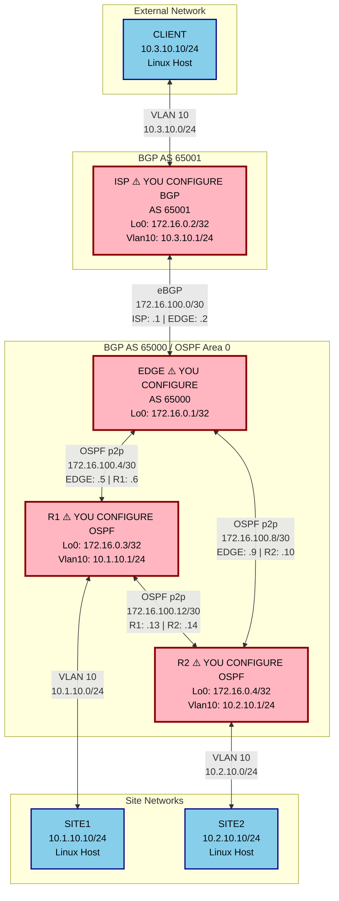

# Layer-3 Advanced Routing Lab - Student Guide

> **📘 Student Lab Mode**: This is a hands-on configuration lab where you will configure OSPF on R1, R2, and EDGE, plus BGP on EDGE and ISP from scratch.

## 🎯 Lab Objectives

In this hands-on lab, you will:
1. **Configure OSPF on R1 and R2** - Set up dynamic routing and redistribute static routes
2. **Configure OSPF on EDGE** - Connect the OSPF domain to the BGP edge
3. **Configure BGP on EDGE and ISP** - Establish external routing between autonomous systems

## 📋 Prerequisites

- Understanding of OSPF concepts (areas, router-id, network types, redistribution)
- Understanding of BGP concepts (AS numbers, eBGP peering, route advertisement)
- Understanding of static routing
- Familiarity with Arista EOS CLI

## 🏗️ Lab Topology Overview

### Network Diagram



### Legend
- ⚠️ **Pink boxes**: Devices YOU will configure
- 🔵 **Blue boxes**: Linux hosts (pre-configured with IP addresses)

### IP Addressing Summary

| Device | Interface | IP Address | Description | Protocol |
|--------|-----------|------------|-------------|----------|
| **ISP** ⚠️ | Loopback0 | 172.16.0.2/32 | Router ID | BGP AS 65001 |
| | Vlan10 | 10.3.10.1/24 | CLIENT Gateway | Static |
| | Ethernet2 | 172.16.100.1/30 | Link to EDGE | **BGP - YOU CONFIGURE** |
| **EDGE** ⚠️ | Loopback0 | 172.16.0.1/32 | Router ID | **OSPF & BGP - YOU CONFIGURE** |
| | Ethernet1 | 172.16.100.2/30 | Link to ISP | **BGP - YOU CONFIGURE** |
| | Ethernet2 | 172.16.100.5/30 | Link to R1 | **OSPF - YOU CONFIGURE** |
| | Ethernet3 | 172.16.100.9/30 | Link to R2 | **OSPF - YOU CONFIGURE** |
| **R1** ⚠️ | Loopback0 | 172.16.0.3/32 | Router ID | **OSPF - YOU CONFIGURE** |
| | Vlan10 | 10.1.10.1/24 | SITE1 Gateway | Static |
| | Ethernet1 | 172.16.100.6/30 | Link to EDGE | **OSPF - YOU CONFIGURE** |
| | Ethernet2 | 172.16.100.13/30 | Link to R2 | **OSPF - YOU CONFIGURE** |
| **R2** ⚠️ | Loopback0 | 172.16.0.4/32 | Router ID | **OSPF - YOU CONFIGURE** |
| | Vlan10 | 10.2.10.1/24 | SITE2 Gateway | Static |
| | Ethernet1 | 172.16.100.10/30 | Link to EDGE | **OSPF - YOU CONFIGURE** |
| | Ethernet2 | 172.16.100.14/30 | Link to R1 | **OSPF - YOU CONFIGURE** |
| **CLIENT** | eth1 | 10.3.10.10/24 | Host IP | Default GW: 10.3.10.1 |
| **SITE1** | eth1 | 10.1.10.10/24 | Host IP | Default GW: 10.1.10.1 |
| **SITE2** | eth1 | 10.2.10.10/24 | Host IP | Default GW: 10.2.10.1 |

### Routing Protocol Summary

| Protocol | Area/AS | Devices | Purpose |
|----------|---------|---------|---------| 
| **OSPF** | Area 0 | R1 ⚠️, R2 ⚠️, EDGE ⚠️ | Internal routing (IGP) |
| **BGP** | AS 65000 | EDGE ⚠️ | External routing (EGP) |
| **BGP** | AS 65001 | ISP ⚠️ | External routing (EGP) |
| **eBGP Peering** | 65000 ↔ 65001 | EDGE ⚠️ ↔ ISP ⚠️ | Inter-AS routing |
| **Static Routes** | N/A | R1, R2, ISP | Site connectivity |

### Network Summary

| Network | Description | Routing Method |
|---------|-------------|----------------|
| 10.1.10.0/24 | SITE1 Network | Static on R1, redistributed to OSPF |
| 10.2.10.0/24 | SITE2 Network | Static on R2, redistributed to OSPF |
| 10.3.10.0/24 | CLIENT Network | Static on ISP, redistributed to BGP |
| 172.16.100.0/30 | ISP-EDGE Link | BGP peering |
| 172.16.100.4/30 | EDGE-R1 Link | OSPF Area 0 |
| 172.16.100.8/30 | EDGE-R2 Link | OSPF Area 0 |
| 172.16.100.12/30 | R1-R2 Link | OSPF Area 0 |
| 172.16.0.x/32 | Loopbacks | OSPF Area 0 (R1, R2, EDGE), BGP (ISP) |

## 🚀 Getting Started

### Step 1: Deploy the Student Lab

**Important**: Use the `start-student` target to deploy the lab with student configurations:

```bash
cd labs/Seminar-3.1
make start-student
```

This will deploy the lab with:
- ⚠️ All routers with interfaces configured but **NO routing protocols configured** (your task)
- ✅ All Linux hosts fully configured with IP addresses and default routes

Wait for all containers to start (approximately 30-60 seconds).

> **Note**: If you want to deploy the fully configured lab for reference, use `make start` instead.

### Step 2: Access the Devices

**SSH to routers** (credentials: `admin` / `admin`):
```bash
ssh admin@isp
ssh admin@edge
ssh admin@r1
ssh admin@r2
```

**Access Linux hosts**:
```bash
docker exec -it clab-Layer-3-Advanced-Lab-Student-client sh
docker exec -it clab-Layer-3-Advanced-Lab-Student-site1 sh
docker exec -it clab-Layer-3-Advanced-Lab-Student-site2 sh
```

---

## 📝 Task 1: Configure OSPF on R1 and R2

### Objective
Configure OSPF on R1 and R2 to enable dynamic routing and redistribute static routes to SITE1 and SITE2.

### Task 1.1: Configure OSPF on R1

**What you need to do:**
1. Create OSPF process 1
2. Set the router-id to the loopback IP (172.16.0.3)
3. Add all networks to OSPF Area 0
4. Redistribute static routes into OSPF

**Configuration Steps:**

SSH to R1:
```bash
ssh admin@r1
```

Enter configuration mode and configure OSPF:
```
configure
router ospf 1
router-id 172.16.0.3
network 172.16.0.3/32 area 0.0.0.0
network 172.16.100.4/30 area 0.0.0.0
network 172.16.100.12/30 area 0.0.0.0
redistribute static
max-lsa 12000
end
write memory
```

**💡 Tips:**
- The `router-id` should match the loopback interface IP
- Use `/32` for loopback networks and `/30` for point-to-point links
- `redistribute static` is crucial - it advertises the SITE1 network (10.1.10.0/24) into OSPF
- Always save your configuration with `write memory`

### Task 1.2: Configure OSPF on R2

**What you need to do:**
1. Create OSPF process 1
2. Set the router-id to the loopback IP (172.16.0.4)
3. Add all networks to OSPF Area 0
4. Redistribute static routes into OSPF

**Configuration Steps:**

SSH to R2:
```bash
ssh admin@r2
```

Enter configuration mode and configure OSPF:
```
configure
router ospf 1
router-id 172.16.0.4
network 172.16.0.4/32 area 0.0.0.0
network 172.16.100.8/30 area 0.0.0.0
network 172.16.100.12/30 area 0.0.0.0
redistribute static
max-lsa 12000
end
write memory
```

**💡 Tips:**
- The router-id should be unique per router (172.16.0.4 for R2)
- Make sure to include both links: to EDGE (172.16.100.8/30) and to R1 (172.16.100.12/30)
- `redistribute static` advertises the SITE2 network (10.2.10.0/24) into OSPF

### Task 1.3: Verify OSPF Adjacency Between R1 and R2

**Verification Commands:**

On R1:
```
show ip ospf neighbor
```

**Expected output:**
```
Neighbor ID     Instance VRF      Pri State                  Dead Time   Address         Interface
172.16.0.4      1        default  0   FULL                   00:00:35    172.16.100.14   Ethernet2
```

On R2:
```
show ip ospf neighbor
```

**Expected output:**
```
Neighbor ID     Instance VRF      Pri State                  Dead Time   Address         Interface
172.16.0.3      1        default  0   FULL                   00:00:38    172.16.100.13   Ethernet2
```

**💡 Tips:**
- The neighbor state should be `FULL` - this means the adjacency is established
- If you don't see neighbors, check:
  - Are the interfaces up? (`show ip interface brief`)
  - Are the networks correctly added to OSPF? (`show run section ospf`)
  - Are there any OSPF errors? (`show ip ospf`)

### Task 1.4: Verify SITE1 and SITE2 Can Communicate

**Test connectivity:**

From SITE1:
```bash
docker exec -it clab-Layer-3-Advanced-Lab-Student-site1 ping -c 3 10.2.10.10
```

**Expected result:** ✅ Ping should succeed (3 packets transmitted, 3 received)

From SITE2:
```bash
docker exec -it clab-Layer-3-Advanced-Lab-Student-site2 ping -c 3 10.1.10.10
```

**Expected result:** ✅ Ping should succeed

**💡 Tips:**
- If ping fails, check the routing tables on R1 and R2:
  ```
  show ip route
  ```
- You should see OSPF routes (marked with `O`) for the remote site network
- Verify that static routes are being redistributed:
  ```
  show ip route 10.1.10.0
  show ip route 10.2.10.0
  ```

---

## 📝 Task 2: Configure OSPF on EDGE

### Objective
Configure OSPF on EDGE to connect the OSPF domain and enable communication between all OSPF routers.

### Task 2.1: Configure OSPF on EDGE

**What you need to do:**
1. Create OSPF process 1
2. Set the router-id to the loopback IP (172.16.0.1)
3. Add all networks to OSPF Area 0

**Configuration Steps:**

SSH to EDGE:
```bash
ssh admin@edge
```

Enter configuration mode and configure OSPF:
```
configure
router ospf 1
router-id 172.16.0.1
network 172.16.0.1/32 area 0.0.0.0
network 172.16.100.4/30 area 0.0.0.0
network 172.16.100.8/30 area 0.0.0.0
max-lsa 12000
end
write memory
```

**💡 Tips:**
- EDGE connects to both R1 and R2, so you need to add both /30 networks
- EDGE does NOT redistribute static routes (it doesn't have any site networks)
- The loopback network (172.16.0.1/32) should be in OSPF for reachability

### Task 2.2: Verify OSPF Neighbors on EDGE

**Verification Commands:**

On EDGE:
```
show ip ospf neighbor
```

**Expected output:**
```
Neighbor ID     Instance VRF      Pri State                  Dead Time   Address         Interface
172.16.0.3      1        default  0   FULL                   00:00:36    172.16.100.6    Ethernet2
172.16.0.4      1        default  0   FULL                   00:00:39    172.16.100.10   Ethernet3
```

**💡 Tips:**
- EDGE should have 2 OSPF neighbors: R1 (172.16.0.3) and R2 (172.16.0.4)
- Both should be in `FULL` state
- If neighbors are not appearing, verify interface IPs and OSPF network statements

### Task 2.3: Verify Loopback Reachability

**Test loopback connectivity:**

From EDGE, ping R1 and R2 loopbacks:
```
ping 172.16.0.3
ping 172.16.0.4
```

From R1, ping EDGE and R2 loopbacks:
```
ping 172.16.0.1
ping 172.16.0.4
```

From R2, ping EDGE and R1 loopbacks:
```
ping 172.16.0.1
ping 172.16.0.3
```

**Expected result:** ✅ All pings should succeed

**💡 Tips:**
- Check the routing table to see OSPF routes:
  ```
  show ip route ospf
  ```
- You should see all loopback addresses as OSPF routes

### Task 2.4: Verify SITE1 Can Reach EDGE

**Test connectivity:**

From SITE1:
```bash
docker exec -it clab-Layer-3-Advanced-Lab-Student-site1 ping -c 3 172.16.0.1
```

**Expected result:** ✅ Ping should succeed

### Task 2.5: Verify SITE2 Can Reach EDGE

**Test connectivity:**

From SITE2:
```bash
docker exec -it clab-Layer-3-Advanced-Lab-Student-site2 ping -c 3 172.16.0.1
```

**Expected result:** ✅ Ping should succeed

**💡 Tips:**
- If sites cannot reach EDGE, verify that:
  - Static routes are being redistributed on R1 and R2
  - EDGE has routes to site networks in its routing table:
    ```
    show ip route 10.1.10.0
    show ip route 10.2.10.0
    ```
  - Routes should be marked as `O E2` (OSPF External Type 2) because they're redistributed

---

## 📝 Task 3: Configure External BGP on EDGE and ISP

### Objective
Configure eBGP between EDGE (AS 65000) and ISP (AS 65001) to enable communication between site networks and the CLIENT network.

### Task 3.1: Configure BGP on EDGE

**What you need to do:**
1. Create BGP process for AS 65000
2. Set the router-id to the loopback IP (172.16.0.1)
3. Configure eBGP neighbor to ISP (172.16.100.1, AS 65001)
4. Redistribute OSPF routes into BGP

**Configuration Steps:**

SSH to EDGE:
```bash
ssh admin@edge
```

Enter configuration mode and configure BGP:
```
configure
router bgp 65000
   router-id 172.16.0.1
   neighbor 172.16.100.1 remote-as 65001
   neighbor 172.16.100.1 description eBGP to ISP
   !
   redistribute ospf
   !
   address-family ipv4
      neighbor 172.16.100.1 activate
      redistribute ospf
end
write memory
```

**💡 Tips:**
- The AS number for EDGE is 65000 (different from ISP's 65001)
- The neighbor IP is ISP's interface IP (172.16.100.1), not the loopback
- `redistribute ospf` is crucial - it advertises SITE1 and SITE2 networks to ISP
- The `address-family ipv4` section activates the neighbor for IPv4

### Task 3.2: Configure BGP on ISP

**What you need to do:**
1. Create BGP process for AS 65001
2. Set the router-id to the loopback IP (172.16.0.2)
3. Configure eBGP neighbor to EDGE (172.16.100.2, AS 65000)
4. Advertise the CLIENT network (10.3.10.0/24)

**Configuration Steps:**

SSH to ISP:
```bash
ssh admin@isp
```

Enter configuration mode and configure BGP:
```
configure
router bgp 65001
   router-id 172.16.0.2
   neighbor 172.16.100.2 remote-as 65000
   neighbor 172.16.100.2 description eBGP to EDGE
   !
   network 10.3.10.0/24
   !
   address-family ipv4
      neighbor 172.16.100.2 activate
end
write memory
```

**💡 Tips:**
- The AS number for ISP is 65001 (different from EDGE's 65000)
- The neighbor IP is EDGE's interface IP (172.16.100.2)
- Use `network 10.3.10.0/24` to advertise the CLIENT network
- Make sure the network statement matches an existing route in the routing table

### Task 3.3: Verify BGP Session Establishment

**Verification Commands:**

On EDGE:
```
show ip bgp summary
```

**Expected output:**
```
Neighbor        V    AS           MsgRcvd   MsgSent  InQ OutQ  Up/Down State   PfxRcd PfxAcc
172.16.100.1    4    65001              X         X    0    0 00:XX:XX Estab        1      1
```

On ISP:
```
show ip bgp summary
```

**Expected output:**
```
Neighbor        V    AS           MsgRcvd   MsgSent  InQ OutQ  Up/Down State   PfxRcd PfxAcc
172.16.100.2    4    65000              X         X    0    0 00:XX:XX Estab        2      2
```

**💡 Tips:**
- The State should be `Estab` (Established) - this means the BGP session is up
- `PfxRcd` shows the number of prefixes received from the neighbor
- ISP should receive 2 prefixes (10.1.10.0/24 and 10.2.10.0/24) from EDGE
- EDGE should receive 1 prefix (10.3.10.0/24) from ISP
- If the session is not established, check:
  - Are the neighbor IPs correct?
  - Are the AS numbers correct?
  - Is there IP connectivity between the neighbors? (`ping 172.16.100.1` from EDGE)

### Task 3.4: Verify BGP Routes

**Check received BGP routes:**

On EDGE:
```
show ip bgp
```

**Expected output:** You should see the CLIENT network (10.3.10.0/24) learned from ISP

On ISP:
```
show ip bgp
```

**Expected output:** You should see SITE1 (10.1.10.0/24) and SITE2 (10.2.10.0/24) networks learned from EDGE

**💡 Tips:**
- BGP routes are marked with `B` in the routing table
- Check if BGP routes are installed in the routing table:
  ```
  show ip route bgp
  ```
- If routes are not appearing, verify redistribution is configured correctly

### Task 3.5: Verify Routing Tables on All Devices

**Check routing tables:**

On R1:
```
show ip route
```
**What to look for:**
- OSPF routes to R2 and EDGE loopbacks
- OSPF external routes to SITE2 network (10.2.10.0/24)
- BGP routes to CLIENT network (10.3.10.0/24) - redistributed from EDGE via OSPF

On R2:
```
show ip route
```
**What to look for:**
- OSPF routes to R1 and EDGE loopbacks
- OSPF external routes to SITE1 network (10.1.10.0/24)
- BGP routes to CLIENT network (10.3.10.0/24) - redistributed from EDGE via OSPF

On EDGE:
```
show ip route
```
**What to look for:**
- OSPF routes to R1 and R2 loopbacks
- OSPF external routes to SITE1 and SITE2 networks
- BGP routes to CLIENT network (10.3.10.0/24)

On ISP:
```
show ip route
```
**What to look for:**
- BGP routes to SITE1 and SITE2 networks (10.1.10.0/24, 10.2.10.0/24)
- Static route to CLIENT network (10.3.10.0/24)

**💡 Tips:**
- Route types in Arista EOS:
  - `C` - Connected
  - `S` - Static
  - `O` - OSPF intra-area
  - `O E2` - OSPF external type 2 (redistributed)
  - `B` - BGP
- If you don't see expected routes, check redistribution configuration

### Task 3.6: Verify SITE1 Can Reach CLIENT

**Test end-to-end connectivity:**

From SITE1:
```bash
docker exec -it clab-Layer-3-Advanced-Lab-Student-site1 ping -c 5 10.3.10.10
```

**Expected result:** ✅ Ping should succeed (5 packets transmitted, 5 received, 0% packet loss)

**Traceroute to see the path:**
```bash
docker exec -it clab-Layer-3-Advanced-Lab-Student-site1 traceroute -n 10.3.10.10
```

**Expected path:**
```
1  10.1.10.1 (R1 - VLAN gateway)
2  172.16.100.5 (EDGE)
3  172.16.100.1 (ISP)
4  10.3.10.10 (CLIENT)
```

**💡 Tips:**
- If ping fails, troubleshoot step by step:
  1. Can SITE1 reach its gateway (R1)? `ping 10.1.10.1`
  2. Does R1 have a route to CLIENT? `show ip route 10.3.10.0`
  3. Can R1 reach EDGE? `ping 172.16.0.1`
  4. Does EDGE have a route to CLIENT? `show ip route 10.3.10.0`
  5. Can EDGE reach ISP? `ping 172.16.100.1`
  6. Is the BGP session up? `show ip bgp summary`

### Task 3.7: Verify SITE2 Can Reach CLIENT

**Test end-to-end connectivity:**

From SITE2:
```bash
docker exec -it clab-Layer-3-Advanced-Lab-Student-site2 ping -c 5 10.3.10.10
```

**Expected result:** ✅ Ping should succeed (5 packets transmitted, 5 received, 0% packet loss)

**Traceroute to see the path:**
```bash
docker exec -it clab-Layer-3-Advanced-Lab-Student-site2 traceroute -n 10.3.10.10
```

**Expected path:**
```
1  10.2.10.1 (R2 - VLAN gateway)
2  172.16.100.9 (EDGE)
3  172.16.100.1 (ISP)
4  10.3.10.10 (CLIENT)
```

**💡 Tips:**
- The path from SITE2 should go through R2 → EDGE → ISP → CLIENT
- If traceroute shows a different path, check OSPF metrics and BGP path selection

---

## 🎓 Lab Completion Checklist

Use this checklist to verify you've completed all tasks:

### Task 1: OSPF on R1 and R2
- [ ] OSPF configured on R1 with correct router-id and networks
- [ ] OSPF configured on R2 with correct router-id and networks
- [ ] Static routes redistributed into OSPF on both R1 and R2
- [ ] R1 and R2 have OSPF adjacency (state: FULL)
- [ ] SITE1 can ping SITE2 (10.2.10.10)
- [ ] SITE2 can ping SITE1 (10.1.10.10)

### Task 2: OSPF on EDGE
- [ ] OSPF configured on EDGE with correct router-id and networks
- [ ] EDGE has OSPF adjacencies with R1 and R2 (both in FULL state)
- [ ] All routers can ping each other's loopbacks
- [ ] SITE1 can ping EDGE loopback (172.16.0.1)
- [ ] SITE2 can ping EDGE loopback (172.16.0.1)
- [ ] EDGE has routes to SITE1 and SITE2 networks (marked as O E2)

### Task 3: BGP on EDGE and ISP
- [ ] BGP configured on EDGE (AS 65000) with eBGP neighbor to ISP
- [ ] BGP configured on ISP (AS 65001) with eBGP neighbor to EDGE
- [ ] OSPF routes redistributed into BGP on EDGE
- [ ] CLIENT network advertised in BGP on ISP
- [ ] BGP session between EDGE and ISP is Established
- [ ] EDGE receives CLIENT network (10.3.10.0/24) via BGP
- [ ] ISP receives SITE1 and SITE2 networks via BGP
- [ ] SITE1 can ping CLIENT (10.3.10.10)
- [ ] SITE2 can ping CLIENT (10.3.10.10)
- [ ] Traceroute from SITE1 to CLIENT shows correct path
- [ ] Traceroute from SITE2 to CLIENT shows correct path

---

## 🔍 Advanced Verification Commands

### OSPF Troubleshooting

**Check OSPF process:**
```
show ip ospf
```

**Check OSPF interfaces:**
```
show ip ospf interface
```

**Check OSPF database:**
```
show ip ospf database
```

**Check OSPF routes:**
```
show ip route ospf
```

### BGP Troubleshooting

**Check BGP neighbors:**
```
show ip bgp neighbors
```

**Check BGP routes:**
```
show ip bgp
```

**Check specific BGP route:**
```
show ip bgp 10.3.10.0/24
```

**Check BGP routes in routing table:**
```
show ip route bgp
```

### General Troubleshooting

**Check all interfaces:**
```
show ip interface brief
```

**Check specific route:**
```
show ip route 10.3.10.0
```

**Check running configuration:**
```
show running-config
```

**Ping with source interface:**
```
ping 10.3.10.10 source 172.16.0.1
```

---

## 📚 Key Concepts Learned

By completing this lab, you have learned:

1. **OSPF Configuration**
   - Configuring OSPF process and router-id
   - Adding networks to OSPF areas
   - Establishing OSPF adjacencies
   - Redistributing static routes into OSPF

2. **BGP Configuration**
   - Configuring eBGP between different autonomous systems
   - Establishing BGP peering sessions
   - Advertising networks in BGP
   - Redistributing IGP routes into BGP

3. **Route Redistribution**
   - Redistributing static routes into OSPF
   - Redistributing OSPF routes into BGP
   - Understanding route types (O, O E2, B)

4. **Inter-VLAN Routing**
   - Using VLAN interfaces as gateways
   - Routing between different VLANs/subnets

5. **End-to-End Connectivity**
   - Verifying connectivity across multiple routing domains
   - Using traceroute to understand packet paths
   - Troubleshooting routing issues

---

## 🎉 Congratulations!

You have successfully configured a multi-protocol routing environment with OSPF and BGP! This lab demonstrates real-world enterprise network design where:
- **OSPF** provides fast, dynamic routing within the organization (IGP)
- **BGP** provides scalable routing between different organizations or ISPs (EGP)
- **Route redistribution** enables communication between different routing domains

This is the foundation of modern enterprise and service provider networks! 🚀

---

## 🧹 Cleanup

When you're done with the lab, stop and remove the containers:

```bash
make stop
```

This will cleanly shut down all containers and remove the lab topology.


