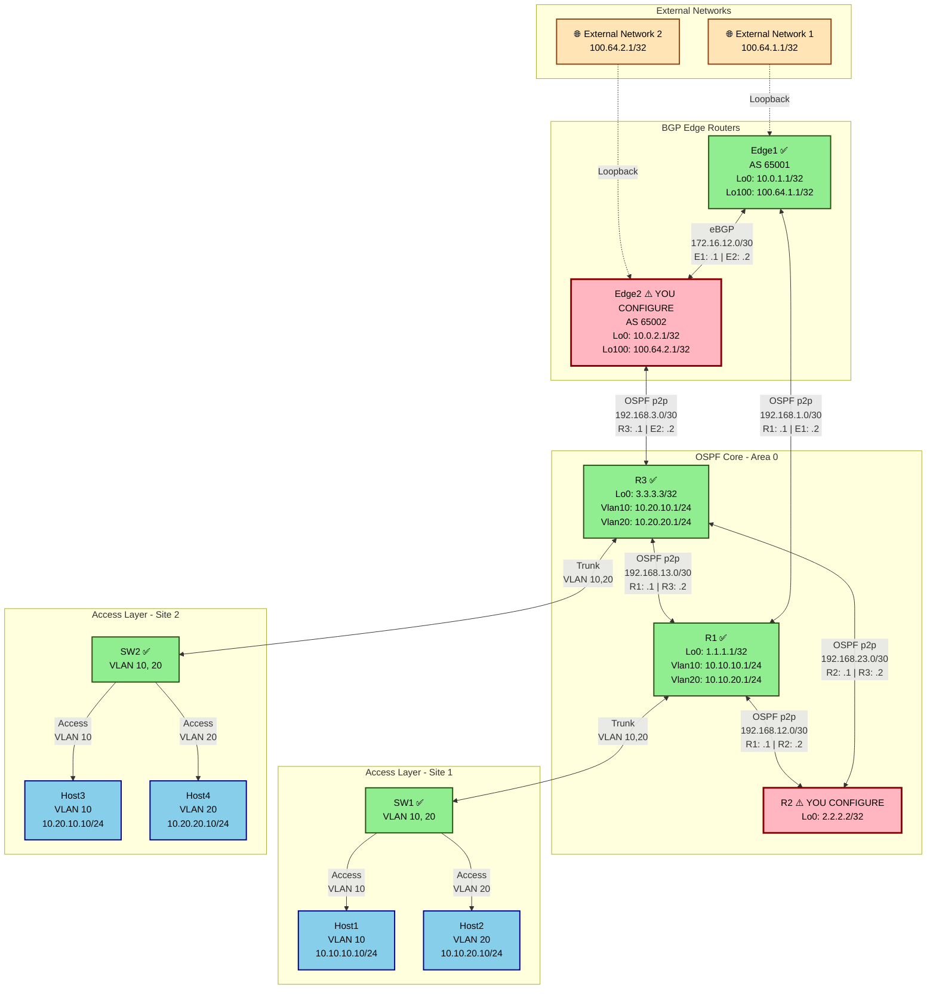

# Layer-3 Student Lab - OSPF & BGP Configuration

> **📘 Student Lab Mode**: This is a hands-on configuration lab where you will configure OSPF on R2 and BGP on Edge2 from scratch. All other devices are pre-configured.

## 🎯 Lab Objectives

In this hands-on lab, you will:
1. **Configure OSPF entirely on R2** - Set up dynamic routing in the OSPF core
2. **Configure BGP on Edge2** - Establish external routing with AS 65002

**Important**: All other devices are pre-configured. You only need to configure R2 and Edge2.

## 📋 Prerequisites

- Understanding of OSPF concepts (areas, router-id, network types)
- Understanding of BGP concepts (AS numbers, eBGP peering, route advertisement)
- Familiarity with Arista EOS CLI

## 🏗️ Lab Topology Overview

### Network Diagram



### Legend
- ✅ **Green boxes**: Pre-configured devices (no action needed)
- ⚠️ **Pink boxes**: Devices YOU will configure (R2 and Edge2)
- 🔵 **Blue boxes**: Linux hosts (pre-configured)
- 🟣 **Purple boxes**: Access switches (pre-configured)
- 🟡 **Beige boxes**: External networks (simulated via loopbacks)

### IP Addressing Summary

| Device | Interface | IP Address | Description | Protocol |
|--------|-----------|------------|-------------|----------|
| **R1** | Loopback0 | 1.1.1.1/32 | Router ID | OSPF Area 0 |
| | Vlan10 | 10.10.10.1/24 | Site 1 VLAN 10 Gateway | OSPF Area 0 (passive) |
| | Vlan20 | 10.10.20.1/24 | Site 1 VLAN 20 Gateway | OSPF Area 0 (passive) |
| | Ethernet1 | 192.168.12.1/30 | Link to R2 | OSPF Area 0 (p2p) |
| | Ethernet2 | 192.168.13.1/30 | Link to R3 | OSPF Area 0 (p2p) |
| | Ethernet3 | 192.168.1.1/30 | Link to Edge1 | OSPF Area 0 (p2p) |
| **R2** ⚠️ | Loopback0 | 2.2.2.2/32 | Router ID | **YOU CONFIGURE** |
| | Ethernet1 | 192.168.12.2/30 | Link to R1 | **YOU CONFIGURE** |
| | Ethernet2 | 192.168.23.1/30 | Link to R3 | **YOU CONFIGURE** |
| **R3** | Loopback0 | 3.3.3.3/32 | Router ID | OSPF Area 0 |
| | Vlan10 | 10.20.10.1/24 | Site 2 VLAN 10 Gateway | OSPF Area 0 (passive) |
| | Vlan20 | 10.20.20.1/24 | Site 2 VLAN 20 Gateway | OSPF Area 0 (passive) |
| | Ethernet1 | 192.168.23.2/30 | Link to R2 | OSPF Area 0 (p2p) |
| | Ethernet2 | 192.168.13.2/30 | Link to R1 | OSPF Area 0 (p2p) |
| | Ethernet3 | 192.168.3.1/30 | Link to Edge2 | OSPF Area 0 (p2p) |
| **Edge1** | Loopback0 | 10.0.1.1/32 | Router ID | OSPF Area 0 |
| | Loopback100 | 100.64.1.1/32 | External Network | BGP AS 65001 |
| | Ethernet1 | 192.168.1.2/30 | Link to R1 | OSPF Area 0 (p2p) |
| | Ethernet2 | 172.16.12.1/30 | eBGP to Edge2 | BGP AS 65001 |
| **Edge2** ⚠️ | Loopback0 | 10.0.2.1/32 | Router ID | **YOU CONFIGURE** |
| | Loopback100 | 100.64.2.1/32 | External Network | **YOU CONFIGURE** |
| | Ethernet1 | 192.168.3.2/30 | Link to R3 | **YOU CONFIGURE** |
| | Ethernet2 | 172.16.12.2/30 | eBGP to Edge1 | **YOU CONFIGURE** |
| **Host1** | eth1 | 10.10.10.10/24 | Site 1 VLAN 10 | Default GW: 10.10.10.1 |
| **Host2** | eth1 | 10.10.20.10/24 | Site 1 VLAN 20 | Default GW: 10.10.20.1 |
| **Host3** | eth1 | 10.20.10.10/24 | Site 2 VLAN 10 | Default GW: 10.20.10.1 |
| **Host4** | eth1 | 10.20.20.10/24 | Site 2 VLAN 20 | Default GW: 10.20.20.1 |

### Routing Protocol Summary

| Protocol | Area/AS | Devices | Purpose |
|----------|---------|---------|---------|
| **OSPF** | Area 0 | R1, R2 ⚠️, R3, Edge1, Edge2 ⚠️ | Internal routing (IGP) |
| **BGP** | AS 65001 | Edge1 | External routing (EGP) |
| **BGP** | AS 65002 | Edge2 ⚠️ | External routing (EGP) - **YOU CONFIGURE** |
| **eBGP Peering** | 65001 ↔ 65002 | Edge1 ↔ Edge2 | Inter-AS routing |

### VLAN Summary

| VLAN | Name | Sites | Gateway IPs | Hosts |
|------|------|-------|-------------|-------|
| **VLAN 10** | Users | Site 1 & 2 | 10.10.10.1 (R1), 10.20.10.1 (R3) | Host1, Host3 |
| **VLAN 20** | Servers | Site 1 & 2 | 10.10.20.1 (R1), 10.20.20.1 (R3) | Host2, Host4 |

## 🚀 Getting Started

### Step 1: Deploy the Student Lab

**Important**: Use the `start-student` target to deploy the lab with student configurations:

```bash
cd labs/Seminar-3
make start-student
```

This will deploy the lab with:
- ✅ R1, R3, Edge1, SW1, SW2, and all hosts **fully configured**
- ⚠️ R2 with interfaces configured but **OSPF not configured** (your task)
- ⚠️ Edge2 with interfaces configured but **OSPF and BGP not configured** (your task)

Wait for all containers to start (approximately 30-60 seconds).

> **Note**: If you want to deploy the fully configured lab for reference, use `make start` instead.

### Step 2: Verify Initial Connectivity

Before configuration, verify that R2 and Edge2 have basic IP connectivity:

```bash
# Connect to R2
ssh admin@r2

# Check interface status
show ip interface brief

# You should see:
# - Ethernet1: 192.168.12.2/30 (Link to R1)
# - Ethernet2: 192.168.23.1/30 (Link to R3)
# - Loopback0: 2.2.2.2/32
```

```bash
# Connect to Edge2
ssh admin@edge2

# Check interface status
show ip interface brief

# You should see:
# - Ethernet1: 192.168.3.2/30 (Link to R3)
# - Ethernet2: 172.16.12.2/30 (Link to Edge1)
# - Loopback0: 10.0.2.1/32
# - Loopback100: 100.64.2.1/32 (External network to advertise)
```

---

## 📝 Part 1: Configure OSPF on R2

### Task 1.1: Configure OSPF Process

Your goal is to configure R2 to participate in the OSPF Area 0 backbone.

**Requirements:**
- OSPF Process ID: 1
- Router ID: 2.2.2.2
- All interfaces should be in Area 0 (0.0.0.0)
- Point-to-point network type on physical interfaces

**Configuration Steps:**

1. Enter configuration mode on R2:
```bash
configure terminal
```

2. Enable OSPF process:
```
router ospf 1
   router-id 2.2.2.2
   max-lsa 12000
   exit
```

3. Configure Ethernet1 (Link to R1):
```
interface Ethernet1
   ip ospf network point-to-point
   ip ospf area 0.0.0.0
   exit
```

4. Configure Ethernet2 (Link to R3):
```
interface Ethernet2
   ip ospf network point-to-point
   ip ospf area 0.0.0.0
   exit
```

5. Configure Loopback0:
```
interface Loopback0
   ip ospf area 0.0.0.0
   exit
```

6. Save configuration:
```
write memory
```

### Task 1.2: Basic OSPF Verification

After configuration, verify OSPF is working:

**1. Check OSPF neighbors:**
```bash
show ip ospf neighbor
```

**Expected output:**
```
Neighbor ID     Instance VRF      Pri State                  Dead Time   Address         Interface
1.1.1.1         1        default  0   FULL                   00:00:35    192.168.12.1    Ethernet1
3.3.3.3         1        default  0   FULL                   00:00:38    192.168.23.2    Ethernet2
```

✅ **Success criteria**: You should see 2 OSPF neighbors (R1 and R3) in FULL state.

**2. Check OSPF routes:**
```bash
show ip route ospf
```

**Expected output**: You should see OSPF routes to:
- Other loopbacks (1.1.1.1/32, 3.3.3.3/32, 10.0.1.1/32, 10.0.2.1/32)
- Other OSPF links
- VLAN networks (10.10.10.0/24, 10.10.20.0/24, 10.20.10.0/24, 10.20.20.0/24)
- BGP routes redistributed into OSPF (100.64.1.1/32, 100.64.2.1/32)

**3. Verify OSPF database:**
```bash
show ip ospf database
```

This shows all LSAs (Link State Advertisements) in the OSPF database.

### Task 1.3: Intermediate OSPF Verification

**1. Check specific OSPF interface details:**
```bash
show ip ospf interface Ethernet1
```

Look for:
- Network Type: POINT_TO_POINT
- Area: 0.0.0.0
- Cost: Should be calculated based on bandwidth
- State: Point-To-Point

**2. Verify OSPF process details:**
```bash
show ip ospf
```

Check:
- Router ID: 2.2.2.2
- Area 0 information
- Number of interfaces in Area 0

**3. Test connectivity to other routers:**
```bash
# Ping R1's loopback
ping 1.1.1.1 source 2.2.2.2

# Ping R3's loopback
ping 3.3.3.3 source 2.2.2.2

# Ping Edge1's loopback
ping 10.0.1.1 source 2.2.2.2

# Ping Edge2's loopback
ping 10.0.2.1 source 2.2.2.2
```

All pings should succeed! ✅

### Task 1.4: Advanced OSPF Verification

**1. Analyze OSPF LSA Types:**
```bash
show ip ospf database router
```

This shows Type-1 Router LSAs. You should see LSAs from R1, R2, R3, Edge1, and Edge2.

**2. Check OSPF network LSAs:**
```bash
show ip ospf database network
```

Since all links are point-to-point, you should see NO network LSAs (Type-2 LSAs are only for broadcast/NBMA networks).

**3. Examine OSPF external routes:**
```bash
show ip ospf database external
```

This shows Type-5 External LSAs for BGP routes redistributed into OSPF (100.64.1.1/32 and 100.64.2.1/32).

**4. Verify OSPF metrics:**
```bash
show ip route 1.1.1.1
```

Check the metric (cost) to reach R1's loopback. The cost should be:
- Cost of Ethernet1 interface (typically 10 for 1Gbps) + cost of R1's loopback interface

**5. Check OSPF timers:**
```bash
show ip ospf interface Ethernet1 | include Timer
```

Default timers:
- Hello: 10 seconds
- Dead: 40 seconds

**6. Monitor OSPF adjacency formation:**
```bash
show ip ospf neighbor detail
```

This provides detailed information about each neighbor including:
- Neighbor state changes
- Dead timer countdown
- Adjacency duration

---

## 📝 Part 2: Configure BGP on Edge2

### Task 2.1: Configure BGP Process

Your goal is to configure Edge2 as an eBGP router in AS 65002, peering with Edge1 (AS 65001).

**Requirements:**
- AS Number: 65002
- Router ID: 10.0.2.1
- eBGP Peer: Edge1 at 172.16.12.1 (AS 65001)
- Advertise network: 100.64.2.1/32 (Loopback100)
- Redistribute BGP routes into OSPF

**Configuration Steps:**

1. Connect to Edge2 and enter configuration mode:
```bash
ssh admin@edge2
configure terminal
```

2. Configure BGP process:
```
router bgp 65002
   router-id 10.0.2.1
   neighbor 172.16.12.1 remote-as 65001
   neighbor 172.16.12.1 description eBGP to Edge1
   network 100.64.2.1/32
   exit
```

3. Activate the neighbor in IPv4 address family:
```
router bgp 65002
   address-family ipv4
      neighbor 172.16.12.1 activate
      exit
   exit
```

4. Redistribute BGP into OSPF (on Edge2's OSPF process):
```
router ospf 1
   redistribute bgp
   exit
```

5. Save configuration:
```
write memory
```

### Task 2.2: Basic BGP Verification

**1. Check BGP summary:**
```bash
show ip bgp summary
```

**Expected output:**
```
BGP summary information for VRF default
Router identifier 10.0.2.1, local AS number 65002
Neighbor Status Codes: m - Under maintenance
  Neighbor    V AS           MsgRcvd   MsgSent  InQ OutQ  Up/Down State   PfxRcd PfxAcc
  172.16.12.1 4 65001              X         X    0    0 00:XX:XX Estab   1      1
```

✅ **Success criteria**: BGP neighbor state should be "Estab" (Established).

**2. Check BGP neighbors:**
```bash
show ip bgp neighbors
```

This provides detailed information about the BGP peering session.

**3. View BGP routes:**
```bash
show ip bgp
```

**Expected output**: You should see:
- Your own network: 100.64.2.1/32 (originated locally)
- Edge1's network: 100.64.1.1/32 (learned from 172.16.12.1)

**4. Verify route advertisement:**
```bash
show ip bgp neighbors 172.16.12.1 advertised-routes
```

You should see 100.64.2.1/32 being advertised to Edge1.

**5. Verify received routes:**
```bash
show ip bgp neighbors 172.16.12.1 routes
```

You should see 100.64.1.1/32 received from Edge1.

### Task 2.3: Intermediate BGP Verification

**1. Check BGP route details:**
```bash
show ip bgp 100.64.1.1
```

This shows detailed information about the route including:
- AS Path: Should show AS 65001
- Next hop: 172.16.12.1
- Local preference, MED, etc.

**2. Verify BGP is in the routing table:**
```bash
show ip route bgp
```

You should see:
```
B E      100.64.1.1/32 [200/0] via 172.16.12.1, Ethernet2
```

The "E" indicates it's an eBGP route.

**3. Test connectivity to Edge1's external network:**
```bash
ping 100.64.1.1 source 100.64.2.1
```

This should succeed! ✅

**4. Verify BGP route redistribution into OSPF:**

From Edge2:
```bash
show ip ospf database external
```

You should see Type-5 LSAs for both:
- 100.64.1.1/32 (from Edge1, redistributed by Edge1 into OSPF)
- 100.64.2.1/32 (your network, redistributed by you into OSPF)

**5. Check from R2 that BGP routes are visible:**

SSH to R2:
```bash
ssh admin@r2
show ip route 100.64.2.1
```

You should see an OSPF external route (O E2) pointing toward Edge2.

### Task 2.4: Advanced BGP Verification

**1. Analyze BGP attributes:**
```bash
show ip bgp 100.64.1.1 detail
```

Examine:
- **Origin**: IGP (i), EGP (e), or Incomplete (?)
- **AS Path**: Should be "65001"
- **Next Hop**: 172.16.12.1
- **Local Preference**: Default 100
- **MED (Multi-Exit Discriminator)**: Check if set

**2. Check BGP best path selection:**
```bash
show ip bgp 100.64.1.1
```

Look for the ">" symbol indicating the best path. Understand why this path was selected.

**3. Verify BGP keepalive and hold timers:**
```bash
show ip bgp neighbors 172.16.12.1 | grep -i timer
```

Default values:
- Keepalive: 60 seconds
- Hold time: 180 seconds

**4. Monitor BGP updates:**
```bash
show ip bgp neighbors 172.16.12.1 | grep -i "message statistics"
```

This shows:
- Opens sent/received
- Updates sent/received
- Keepalives sent/received
- Notifications (errors)

**5. Check BGP capabilities:**
```bash
show ip bgp neighbors 172.16.12.1 | grep -i capabilities
```

Look for:
- Multiprotocol Extensions
- Route Refresh
- 4-byte AS support
- Graceful Restart

**6. Verify AS path filtering (optional advanced):**
```bash
show ip bgp regexp ^65001$
```

This shows only routes originating from AS 65001 (Edge1's routes).

**7. Test BGP route propagation across the network:**

From R2, verify you can reach both external networks:
```bash
ssh admin@r2
ping 100.64.1.1 source 2.2.2.2
ping 100.64.2.1 source 2.2.2.2
```

Both should succeed! ✅

---

## 🧪 Part 3: End-to-End Verification

### Task 3.1: Full Network Connectivity Test

Now that both OSPF on R2 and BGP on Edge2 are configured, verify full network connectivity.

**1. From R2, ping all critical endpoints:**
```bash
ssh admin@r2

# Ping all router loopbacks
ping 1.1.1.1 source 2.2.2.2
ping 3.3.3.3 source 2.2.2.2
ping 10.0.1.1 source 2.2.2.2
ping 10.0.2.1 source 2.2.2.2

# Ping external networks
ping 100.64.1.1 source 2.2.2.2
ping 100.64.2.1 source 2.2.2.2

# Ping VLAN gateways
ping 10.10.10.1 source 2.2.2.2
ping 10.10.20.1 source 2.2.2.2
ping 10.20.10.1 source 2.2.2.2
ping 10.20.20.1 source 2.2.2.2
```

All pings should succeed! ✅

**2. From Edge2, verify full reachability:**
```bash
ssh admin@edge2

# Ping all OSPF routers
ping 1.1.1.1 source 10.0.2.1
ping 2.2.2.2 source 10.0.2.1
ping 3.3.3.3 source 10.0.2.1

# Ping Edge1
ping 10.0.1.1 source 10.0.2.1

# Ping Edge1's external network
ping 100.64.1.1 source 100.64.2.1
```

All pings should succeed! ✅

### Task 3.2: Verify Routing Tables

**1. Check R2's complete routing table:**
```bash
ssh admin@r2
show ip route
```

You should see:
- **C** (Connected) routes for directly connected networks
- **O** (OSPF) routes for OSPF-learned routes
- **O E2** (OSPF External Type-2) routes for BGP routes redistributed into OSPF

**2. Check Edge2's complete routing table:**
```bash
ssh admin@edge2
show ip route
```

You should see:
- **C** (Connected) routes
- **O** (OSPF) routes for internal networks
- **B E** (BGP External) routes for Edge1's networks

### Task 3.3: Trace Route Paths

**1. Trace path from R2 to Edge1's external network:**
```bash
ssh admin@r2
traceroute 100.64.1.1 source 2.2.2.2
```

Expected path:
```
1. 192.168.12.1 (R1)
2. 192.168.1.2 (Edge1)
3. 100.64.1.1 (destination)
```

**2. Trace path from R2 to Edge2's external network:**
```bash
traceroute 100.64.2.1 source 2.2.2.2
```

Expected path:
```
1. 192.168.23.2 (R3)
2. 192.168.3.2 (Edge2)
3. 100.64.2.1 (destination)
```

### Task 3.4: Protocol Interaction Analysis

**1. Verify OSPF is redistributing BGP routes:**

From R1 (which is pre-configured):
```bash
ssh admin@r1
show ip route 100.64.2.1
```

You should see:
```
O E2     100.64.2.1/32 [110/1] via 192.168.3.2, Ethernet3
```

This confirms Edge2 is successfully redistributing its BGP route into OSPF.

**2. Verify BGP routes are propagating through OSPF:**

From R2:
```bash
ssh admin@r2
show ip route ospf | include 100.64
```

You should see both external networks learned via OSPF:
- 100.64.1.1/32 (from Edge1)
- 100.64.2.1/32 (from Edge2)

**3. Check OSPF cost to external networks:**
```bash
ssh admin@r2
show ip route 100.64.1.1
show ip route 100.64.2.1
```

Compare the metrics. The cost should reflect the OSPF path to each edge router.

---

## 🎓 Part 4: Advanced Challenges

### Challenge 4.1: OSPF Path Manipulation

**Objective**: Change the OSPF cost on R2's Ethernet1 interface to prefer the path through R3.

**Steps**:
1. On R2, increase the cost of Ethernet1:
```bash
configure terminal
interface Ethernet1
   ip ospf cost 100
   exit
write memory
```

2. Verify the routing table changed:
```bash
show ip route 1.1.1.1
```

The path to R1 should now go through R3 instead of directly.

3. Restore the default cost:
```bash
configure terminal
interface Ethernet1
   no ip ospf cost
   exit
write memory
```

### Challenge 4.2: BGP Route Filtering

**Objective**: Configure a route-map on Edge2 to set a specific MED value for advertised routes.

**Steps**:
1. Create a route-map:
```bash
configure terminal
route-map SET_MED permit 10
   set metric 50
   exit
```

2. Apply to BGP neighbor:
```bash
router bgp 65002
   neighbor 172.16.12.1 route-map SET_MED out
   exit
write memory
```

3. Verify on Edge1:
```bash
ssh admin@edge1
show ip bgp 100.64.2.1
```

You should see MED = 50 for the route from Edge2.

4. Remove the route-map (cleanup):
```bash
ssh admin@edge2
configure terminal
router bgp 65002
   no neighbor 172.16.12.1 route-map SET_MED out
   exit
no route-map SET_MED
write memory
```

### Challenge 4.3: OSPF Passive Interface

**Objective**: Understand the impact of passive interfaces in OSPF.

**Question**: Why don't we need to configure passive interfaces on R2?

**Answer**: R2 only has OSPF-enabled interfaces that should form adjacencies (Ethernet1, Ethernet2, and Loopback0). Unlike R1 and R3, R2 doesn't have VLAN interfaces where we want OSPF to advertise the network but NOT form adjacencies with hosts.

**Experiment** (optional):
1. Make Loopback0 passive:
```bash
configure terminal
router ospf 1
   passive-interface Loopback0
   exit
write memory
```

2. Check OSPF interfaces:
```bash
show ip ospf interface
```

Loopback0 should still be advertised but won't try to form adjacencies (which doesn't matter for a loopback).

3. Remove passive interface:
```bash
configure terminal
router ospf 1
   no passive-interface Loopback0
   exit
write memory
```

### Challenge 4.4: BGP AS Path Prepending

**Objective**: Make Edge2's route less preferred by prepending AS numbers.

**Steps**:
1. Create a route-map with AS path prepending:
```bash
configure terminal
route-map PREPEND_AS permit 10
   set as-path prepend 65002 65002 65002
   exit
```

2. Apply to BGP neighbor:
```bash
router bgp 65002
   neighbor 172.16.12.1 route-map PREPEND_AS out
   exit
write memory
```

3. Verify on Edge1:
```bash
ssh admin@edge1
show ip bgp 100.64.2.1
```

The AS path should now be: 65002 65002 65002 65002 (original + 3 prepends).

4. Cleanup:
```bash
ssh admin@edge2
configure terminal
router bgp 65002
   no neighbor 172.16.12.1 route-map PREPEND_AS out
   exit
no route-map PREPEND_AS
write memory
```

---

## 📊 Part 5: Troubleshooting Scenarios

### Scenario 5.1: OSPF Neighbor Not Forming

**Symptom**: OSPF neighbor on R2 is stuck in INIT or EXSTART state.

**Troubleshooting steps**:

1. Check interface status:
```bash
show ip interface brief
```

2. Verify OSPF is enabled on the interface:
```bash
show ip ospf interface Ethernet1
```

3. Check for network type mismatch:
```bash
show ip ospf interface Ethernet1 | grep "Network Type"
```

Should be POINT_TO_POINT on both sides.

4. Verify area configuration:
```bash
show ip ospf interface Ethernet1 | grep Area
```

Should be Area 0.0.0.0 on both sides.

5. Check for MTU mismatch:
```bash
show interfaces Ethernet1 | grep MTU
```

6. Enable OSPF debugging (use carefully):
```bash
debug ip ospf adj
```

Then disable:
```bash
no debug ip ospf adj
```

### Scenario 5.2: BGP Session Not Establishing

**Symptom**: BGP neighbor state is "Active" or "Connect" instead of "Estab".

**Troubleshooting steps**:

1. Verify IP connectivity:
```bash
ping 172.16.12.1 source 172.16.12.2
```

2. Check BGP configuration:
```bash
show run section bgp
```

3. Verify neighbor configuration:
```bash
show ip bgp neighbors 172.16.12.1
```

Look for:
- Remote AS number (should be 65001)
- Connection state
- Error messages

4. Check for ACLs blocking TCP port 179:
```bash
show ip access-lists
```

5. Verify BGP is listening:
```bash
show tcp brief | include 179
```

6. Enable BGP debugging:
```bash
debug ip bgp
```

Then disable:
```bash
no debug ip bgp
```

### Scenario 5.3: Routes Not Appearing in Routing Table

**Symptom**: BGP routes are learned but not installed in the routing table.

**Troubleshooting steps**:

1. Check BGP table:
```bash
show ip bgp
```

Look for ">" symbol indicating best path.

2. Check routing table:
```bash
show ip route bgp
```

3. Verify there's no better route from another protocol:
```bash
show ip route 100.64.1.1
```

4. Check administrative distance:
```bash
show ip route detail
```

BGP (eBGP) should have AD = 20, OSPF has AD = 110.

5. Verify next-hop reachability:
```bash
show ip bgp 100.64.1.1
```

The next-hop must be reachable.

---

## ✅ Part 6: Verification Checklist

Use this checklist to confirm your configuration is complete and correct:

### R2 OSPF Configuration Checklist

- [ ] OSPF process 1 is configured with router-id 2.2.2.2
- [ ] Ethernet1 is in OSPF area 0 with point-to-point network type
- [ ] Ethernet2 is in OSPF area 0 with point-to-point network type
- [ ] Loopback0 is in OSPF area 0
- [ ] OSPF neighbor with R1 (1.1.1.1) is in FULL state
- [ ] OSPF neighbor with R3 (3.3.3.3) is in FULL state
- [ ] R2 can ping all router loopbacks (1.1.1.1, 3.3.3.3, 10.0.1.1, 10.0.2.1)
- [ ] R2 can ping external networks (100.64.1.1, 100.64.2.1)
- [ ] R2 has OSPF routes to all VLANs
- [ ] Configuration is saved with `write memory`

### Edge2 BGP Configuration Checklist

- [ ] BGP process 65002 is configured with router-id 10.0.2.1
- [ ] eBGP neighbor 172.16.12.1 (Edge1, AS 65001) is configured
- [ ] BGP neighbor state is "Estab" (Established)
- [ ] Network 100.64.2.1/32 is advertised in BGP
- [ ] Edge2 receives 100.64.1.1/32 from Edge1
- [ ] BGP routes are redistributed into OSPF
- [ ] Edge2 can ping 100.64.1.1 from 100.64.2.1
- [ ] Edge2 can ping all OSPF router loopbacks
- [ ] Other routers (R1, R2, R3) can reach 100.64.2.1 via OSPF
- [ ] Configuration is saved with `write memory`

### End-to-End Connectivity Checklist

- [ ] All routers can ping each other's loopbacks
- [ ] All routers can reach both external networks (100.64.1.1 and 100.64.2.1)
- [ ] Traceroute from R2 to 100.64.1.1 shows correct path through R1 and Edge1
- [ ] Traceroute from R2 to 100.64.2.1 shows correct path through R3 and Edge2
- [ ] OSPF database shows Type-5 LSAs for both external networks
- [ ] BGP table on Edge2 shows both local and received routes

---

## 🎯 Learning Outcomes

After completing this lab, you should be able to:

### OSPF Skills
1. ✅ Configure OSPF process with router-id
2. ✅ Enable OSPF on interfaces and assign them to areas
3. ✅ Configure point-to-point network type for OSPF
4. ✅ Verify OSPF neighbor adjacencies
5. ✅ Interpret OSPF routing table entries
6. ✅ Analyze OSPF LSA database
7. ✅ Understand OSPF metrics and path selection
8. ✅ Troubleshoot OSPF neighbor issues

### BGP Skills
1. ✅ Configure eBGP peering between different AS numbers
2. ✅ Advertise networks in BGP
3. ✅ Verify BGP neighbor establishment
4. ✅ Interpret BGP routing table
5. ✅ Understand BGP attributes (AS path, next-hop, MED, local preference)
6. ✅ Configure route redistribution between BGP and OSPF
7. ✅ Analyze BGP best path selection
8. ✅ Troubleshoot BGP session issues

### Integration Skills
1. ✅ Understand interaction between IGP (OSPF) and EGP (BGP)
2. ✅ Configure route redistribution between protocols
3. ✅ Verify end-to-end connectivity across multiple routing domains
4. ✅ Trace packet paths through complex topologies
5. ✅ Analyze routing decisions across protocol boundaries

---

## 📚 Reference Commands

### Quick OSPF Commands
```bash
# Show OSPF neighbors
show ip ospf neighbor

# Show OSPF routes
show ip route ospf

# Show OSPF database
show ip ospf database

# Show OSPF interface details
show ip ospf interface

# Show OSPF process information
show ip ospf

# Show running config for OSPF
show run section ospf
```

### Quick BGP Commands
```bash
# Show BGP summary
show ip bgp summary

# Show BGP table
show ip bgp

# Show BGP neighbors
show ip bgp neighbors

# Show BGP routes from specific neighbor
show ip bgp neighbors <ip> routes

# Show BGP routes advertised to neighbor
show ip bgp neighbors <ip> advertised-routes

# Show specific BGP route details
show ip bgp <prefix>

# Show running config for BGP
show run section bgp
```

### General Routing Commands
```bash
# Show full routing table
show ip route

# Show specific route
show ip route <ip>

# Show routes by protocol
show ip route ospf
show ip route bgp
show ip route connected

# Ping with source
ping <destination> source <source-ip>

# Traceroute with source
traceroute <destination> source <source-ip>

# Show interface status
show ip interface brief

# Show running configuration
show running-config
```

---

## 🧹 Cleanup

When you're done with the lab:

```bash
# From the lab directory
make stop

# To completely remove the lab
make clean
```

---

## 💡 Tips and Best Practices

### Configuration Tips
1. **Always save your configuration** with `write memory` after making changes
2. **Use descriptive neighbor descriptions** in BGP to document peering relationships
3. **Verify each step** before moving to the next configuration task
4. **Use source IP in ping/traceroute** to test from specific interfaces

### Troubleshooting Tips
1. **Start with basic connectivity** - Can you ping the neighbor IP?
2. **Check interface status** - Is the interface up/up?
3. **Verify configuration** - Use `show run section <protocol>` to review config
4. **Check protocol-specific tables** - OSPF database, BGP table, routing table
5. **Use show commands before debug** - Debug should be last resort
6. **Compare with working devices** - Check R1 or R3 configuration for reference

### Common Mistakes to Avoid
1. ❌ Forgetting to configure `ip ospf area` on interfaces
2. ❌ Mismatching OSPF network types (broadcast vs point-to-point)
3. ❌ Wrong AS numbers in BGP configuration
4. ❌ Forgetting to activate BGP neighbors in address-family
5. ❌ Not redistributing BGP into OSPF on edge routers
6. ❌ Forgetting to save configuration with `write memory`

---

## 📖 Additional Resources

### OSPF Resources
- RFC 2328: OSPF Version 2
- Arista EOS OSPF Configuration Guide
- OSPF LSA Types explained

### BGP Resources
- RFC 4271: Border Gateway Protocol 4
- Arista EOS BGP Configuration Guide
- BGP Best Path Selection Algorithm

### Lab Resources
- [QUICK_REFERENCE.md](QUICK_REFERENCE.md) - Quick command reference
- [README.md](README.md) - Full lab documentation with all exercises
- [BUILD_GUIDE.md](BUILD_GUIDE.md) - Complete build guide for all devices

---

## ❓ Frequently Asked Questions

**Q: Why do we use point-to-point network type for OSPF?**
A: Point-to-point is more efficient for direct links between two routers. It doesn't require DR/BDR election and forms adjacencies faster.

**Q: What's the difference between iBGP and eBGP?**
A: eBGP is used between different AS numbers (like Edge1 and Edge2). iBGP is used within the same AS. eBGP has AD=20, iBGP has AD=200.

**Q: Why redistribute BGP into OSPF?**
A: To allow internal OSPF routers (R1, R2, R3) to learn about external networks reachable via BGP without running BGP themselves.

**Q: What happens if I don't configure a router-id?**
A: The router will automatically select the highest IP address on a loopback interface, or the highest IP on a physical interface if no loopback exists.

**Q: Can I use a different OSPF process ID on different routers?**
A: Yes! OSPF process IDs are locally significant. Routers with different process IDs can still form adjacencies as long as area numbers match.

**Q: Why does Edge2 need both OSPF and BGP?**
A: Edge2 uses BGP to peer with external networks (Edge1) and OSPF to communicate with the internal network (R1, R2, R3). It's a border router.

---

**🎉 Congratulations!**

You've successfully configured OSPF on R2 and BGP on Edge2, and verified full network connectivity. You now understand how dynamic routing protocols work together to create a functional enterprise network!

**Next Steps:**
- Try the advanced challenges to deepen your understanding
- Experiment with route manipulation techniques
- Explore the full lab in [README.md](README.md) for more exercises
- Build the entire lab from scratch using [BUILD_GUIDE.md](BUILD_GUIDE.md)

---

**Lab Version**: 1.0
**Last Updated**: 2026-03-07
**Author**: Network-101 Lab Series

