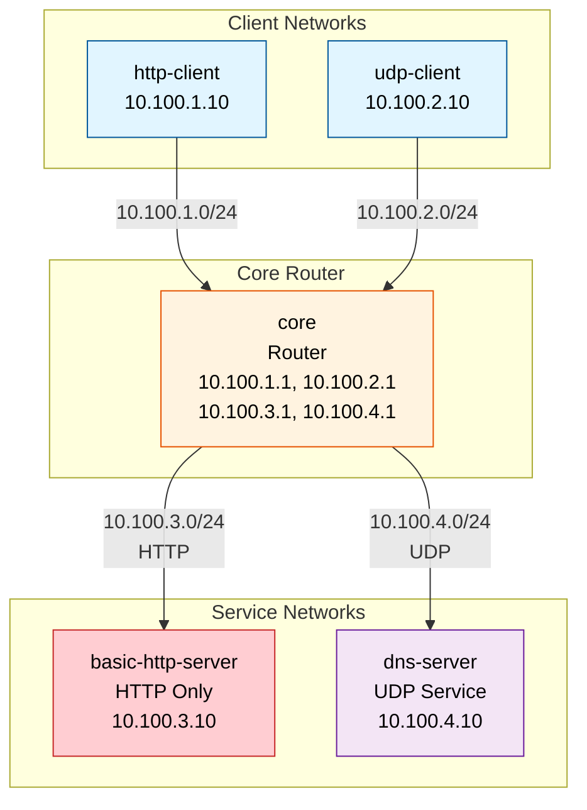
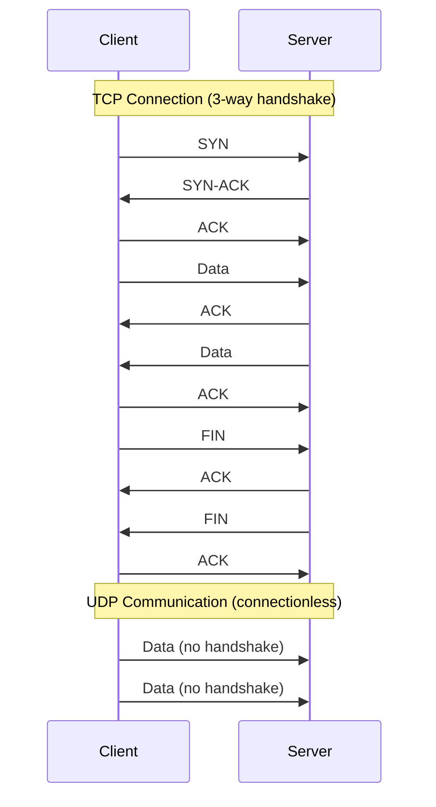
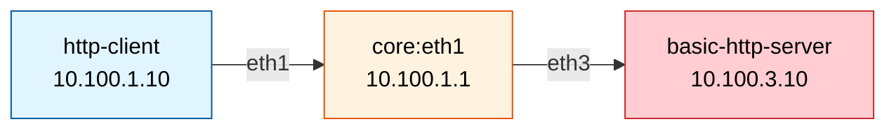

# Layer-4.1 Lab - Wireshark Analysis

The purpose of this lab is to illustrate UDP and TCP based services by using Wireshark and tcpdump tools for packet analysis.

## Lab Overview

This lab demonstrates:
- **UDP Services**: DNS/DHCP for dynamic IP address assignment
- **TCP Services**: Basic HTTP web service (unencrypted)
- **Packet Capture**: Using tcpdump and Wireshark for traffic analysis
- **Protocol Analysis**: Understanding TCP 3-way handshake and UDP connectionless communication

## Lab Components

### Network Devices (Arista cEOS Routers)
- **core**: Central routing hub connecting clients and servers (10.100.1.1, 10.100.2.1, 10.100.3.1, 10.100.4.1)

### Service Containers
- **basic-http-server**: NGINX web server with HTTP only - UNENCRYPTED (10.100.3.10)
- **dns-server**: DNS/DHCP server (10.100.4.10)

### Client Containers
- **http-client**: Client for testing HTTP/TCP services (10.100.1.10)
- **udp-client**: Client for testing UDP services (10.100.2.10)

## Network Topology

### Visual Diagram



### Text Representation

```
http-client     udp-client
(10.100.1.10)   (10.100.2.10)
     \              /
      \            /
       \          /
    +----------------+
    |     core       |
    |   (Router)     |
    +----------------+
       /     |
      /      |
     /       |
basic-http   dns-
server       server
(10.100.3.10) (10.100.4.10)
```

## IP Addressing Scheme

### Router Loopback
- core: 1.1.1.1/32

### Client Networks
- HTTP Client Network: 10.100.1.0/24
  - http-client: 10.100.1.10/24
  - Gateway: 10.100.1.1 (core)
- UDP Client Network: 10.100.2.0/24
  - udp-client: 10.100.2.10/24
  - Gateway: 10.100.2.1 (core)

### Service Networks
- Basic HTTP Server Network: 10.100.3.0/24
  - core: 10.100.3.1/24
  - basic-http-server: 10.100.3.10/24
- DNS Server Network: 10.100.4.0/24
  - core: 10.100.4.1/24
  - dns-server: 10.100.4.10/24

---

## Getting Started

### Prerequisites
- Containerlab installed
- Docker installed
- Arista cEOS image: `ceos:4.35.0F`
- Basic understanding of networking concepts

### Deploy the Lab

```bash
# Navigate to the lab directory
cd labs/Seminar-4.1

# Start the lab
make start

# Check lab status
make inspect

# Stop the lab when done
make stop
```

### Access Lab Devices

```bash
# Access the core router
ssh admin@core
# Password: admin

# Access client containers
docker exec -it http-client sh
docker exec -it udp-client sh

# Access service containers
docker exec -it basic-http-server sh
docker exec -it dns-server sh
```

---

## Lab Exercises

### Part 1: TCP Service - HTTP Analysis

#### Exercise 1.1: Test HTTP Connectivity

**Objective**: Verify basic HTTP connectivity and understand TCP-based communication.

**Steps**:

1. **Access the HTTP client**:
```bash
docker exec -it http-client sh
```

2. **Test connectivity to the HTTP server**:
```bash
# Ping test
ping -c 3 10.100.3.10

# HTTP request
curl http://10.100.3.10/

# Test health endpoint
curl http://10.100.3.10/health

# Test API endpoint
curl http://10.100.3.10/api
```

**Expected Results**:
- Ping should succeed
- HTTP requests should return HTML content
- Health endpoint returns "Basic HTTP Server OK (UNENCRYPTED)"
- API endpoint returns JSON data

#### Exercise 1.2: Capture TCP Traffic with tcpdump

**Objective**: Capture and analyze TCP 3-way handshake and HTTP traffic.

**Steps**:

1. **Start packet capture on the core router** (Terminal 1):
```bash
ssh admin@core
bash
tcpdump -i eth3 'host 10.100.3.10 and port 80' -nn -v
```

2. **Generate HTTP traffic** (Terminal 2):
```bash
docker exec -it http-client curl http://10.100.3.10/health
```

3. **Observe the output** in Terminal 1

**What to Look For**:
- **TCP 3-way handshake**:
  - SYN (client → server)
  - SYN-ACK (server → client)
  - ACK (client → server)
- **HTTP Request**: GET /health HTTP/1.1
- **HTTP Response**: HTTP/1.1 200 OK
- **TCP Connection Teardown**: FIN, ACK packets

#### Exercise 1.3: Detailed TCP Analysis with Wireshark

**Objective**: Capture TCP traffic to a file and analyze with Wireshark.

**Steps**:

1. **Capture to file on core router**:
```bash
ssh admin@core
bash
tcpdump -i eth3 'host 10.100.3.10 and port 80' -w /tmp/http_traffic.pcap
```

2. **In another terminal, generate traffic**:
```bash
docker exec -it http-client sh
# Make multiple requests
for i in 1 2 3; do curl http://10.100.3.10/health; sleep 1; done
```

3. **Stop the capture** (Ctrl+C in Terminal 1)

4. **Copy the file to your host**:
```bash
docker cp core:/tmp/http_traffic.pcap ./http_traffic.pcap
```

5. **Open in Wireshark** and analyze:
   - Filter: `tcp.port == 80`
   - Follow TCP Stream
   - Examine TCP flags
   - View HTTP headers and body

**Analysis Questions**:
- How many TCP connections were established?
- What is the sequence number of the first SYN packet?
- Can you read the HTTP request and response in plain text?
- What is the TCP window size?

---

### Part 2: UDP Service - DNS/DHCP Analysis

#### Exercise 2.1: Test UDP Connectivity

**Objective**: Understand UDP connectionless communication.

**Steps**:

1. **Access the UDP client**:
```bash
docker exec -it udp-client sh
```

2. **Test connectivity to DNS server**:
```bash
# Ping test
ping -c 3 10.100.4.10

# Test UDP with netcat
echo "test" | nc -u 10.100.4.10 53
```

#### Exercise 2.2: Capture UDP Traffic

**Objective**: Capture and analyze UDP packets.

**Steps**:

1. **Start packet capture on core router** (Terminal 1):
```bash
ssh admin@core
bash
tcpdump -i eth4 'host 10.100.4.10 and udp' -nn -v
```

2. **Generate UDP traffic** (Terminal 2):
```bash
docker exec -it udp-client sh
# Send UDP packets with netcat
echo "UDP Test Message" | nc -u 10.100.4.10 53
```

3. **Observe the output**

**What to Look For**:
- **No handshake**: UDP is connectionless
- **Single packet**: Request sent immediately
- **No acknowledgment**: UDP doesn't guarantee delivery

#### Exercise 2.3: Compare TCP vs UDP

**Objective**: Understand the differences between TCP and UDP protocols.

**Comparison Diagram**:



**Steps**:

1. **Capture both TCP and UDP traffic simultaneously**:

Terminal 1 - TCP capture:
```bash
ssh admin@core
bash
tcpdump -i eth3 'tcp port 80' -w /tmp/tcp_traffic.pcap
```

Terminal 2 - UDP capture:
```bash
ssh admin@core
bash
tcpdump -i eth4 'udp' -w /tmp/udp_traffic.pcap
```

Terminal 3 - Generate TCP traffic:
```bash
docker exec -it http-client curl http://10.100.3.10/health
```

Terminal 4 - Generate UDP traffic:
```bash
docker exec -it udp-client sh
echo "test" | nc -u 10.100.4.10 53
```

2. **Stop captures and copy files**:
```bash
docker cp core:/tmp/tcp_traffic.pcap ./tcp_traffic.pcap
docker cp core:/tmp/udp_traffic.pcap ./udp_traffic.pcap
```

3. **Analyze in Wireshark**

**Comparison Table**:

| Feature | TCP | UDP |
|---------|-----|-----|
| Connection | Connection-oriented (3-way handshake) | Connectionless |
| Reliability | Guaranteed delivery with ACKs | No delivery guarantee |
| Ordering | Packets delivered in order | No ordering guarantee |
| Speed | Slower (overhead from handshake/ACKs) | Faster (no overhead) |
| Header Size | 20-60 bytes | 8 bytes |
| Use Cases | HTTP, HTTPS, FTP, SSH | DNS, DHCP, VoIP, Streaming |
| Error Checking | Extensive | Basic checksum only |

---


### Part 3: Advanced Wireshark Analysis

#### Exercise 3.1: HTTP Security Analysis

**Objective**: Understand why HTTP is insecure and why HTTPS is necessary.

**Steps**:

1. **Capture HTTP traffic with full packet content**:
```bash
ssh admin@core
bash
tcpdump -i eth3 'port 80' -A -w /tmp/http_insecure.pcap
```

2. **Simulate a login attempt** (in another terminal):
```bash
docker exec -it http-client sh
# Simulate sending credentials (THIS IS INSECURE!)
curl -X POST http://10.100.3.10/api \
  -d "username=student&password=secret123"
```

3. **Stop capture and analyze**:
```bash
# View the capture with ASCII output
tcpdump -r /tmp/http_insecure.pcap -A | grep -i "password"
```

**Key Observation**:
- You can see the password in **PLAIN TEXT**!
- This demonstrates why HTTPS is essential for production systems

#### Exercise 3.2: Packet Capture at Multiple Points

**Objective**: Understand how packets traverse the network.

**Network Path Diagram**:



**Capture Points**:

1. **Point 1: At the client** (source):
```bash
docker exec -it http-client tcpdump -i eth1 'host 10.100.3.10' -nn -v
```

2. **Point 2: At the core router** (intermediate):
```bash
ssh admin@core
bash
tcpdump -i eth1 'host 10.100.3.10' -nn -v
# Or on the server-side interface
tcpdump -i eth3 'host 10.100.1.10' -nn -v
```

3. **Point 3: At the server** (destination):
```bash
docker exec -it basic-http-server tcpdump -i eth1 'host 10.100.1.10' -nn -v
```

4. **Generate traffic**:
```bash
docker exec -it http-client curl http://10.100.3.10/health
```

**Analysis**:
- Observe the same packets at all three capture points
- Note the TTL (Time To Live) decreases at each hop
- Verify source and destination IPs remain the same

#### Exercise 3.3: TCP Window Size and Flow Control

**Objective**: Understand TCP flow control mechanisms.

**Steps**:

1. **Capture with detailed TCP information**:
```bash
ssh admin@core
bash
tcpdump -i eth3 'tcp port 80' -nn -vv -w /tmp/tcp_flow.pcap
```

2. **Generate traffic**:
```bash
docker exec -it http-client sh
# Make a request
curl http://10.100.3.10/
```

3. **Analyze in Wireshark**:
   - Open tcp_flow.pcap
   - Go to Statistics → TCP Stream Graphs → Window Scaling
   - Observe TCP window size changes
   - Look for TCP window updates

**Questions to Answer**:
- What is the initial TCP window size?
- Does the window size change during the connection?
- Are there any TCP retransmissions?

#### Exercise 3.4: Large File Transfer Analysis - Les Trois Mousquetaires

**Objective**: Analyze TCP segmentation, window scaling, and flow control during a large file transfer.

**Background**: The server hosts a copy of "Les Trois Mousquetaires" by Alexandre Dumas (4247 lines, ~500KB). This large file will be split into multiple TCP segments, allowing you to observe:
- TCP segmentation and reassembly
- Window size scaling
- Sequence and acknowledgment numbers
- TCP flow control in action

**Steps**:

1. **Start packet capture**:
```bash
ssh admin@core
bash
tcpdump -i eth3 'host 10.100.3.10 and port 80' -nn -vv -w /tmp/3mq_transfer.pcap
```

2. **In another terminal, request the large file**:
```bash
docker exec -it http-client sh

# Option 1: Download the HTML page
curl http://10.100.3.10/3mq.html -o /tmp/3mq.html

# Option 2: Download the raw text file
curl http://10.100.3.10/3mq.txt -o /tmp/3mq.txt

# Option 3: View transfer statistics
curl -w "\nBytes Downloaded: %{size_download}\nSpeed: %{speed_download} bytes/sec\nTotal Time: %{time_total}s\n" \
  -o /dev/null http://10.100.3.10/3mq.txt
```

3. **Stop the capture** (Ctrl+C in Terminal 1)

4. **Copy the capture file to your local machine**:
```bash
# From your local machine
docker cp core:/tmp/3mq_transfer.pcap ./3mq_transfer.pcap
```

5. **Analyze in Wireshark**:
   - Open `3mq_transfer.pcap`
   - Filter: `tcp.stream eq 0` (to see the first TCP stream)
   - Right-click on any packet → Follow → TCP Stream
   - Go to Statistics → TCP Stream Graphs → Time-Sequence (Stevens)
   - Go to Statistics → TCP Stream Graphs → Throughput

**What to Look For**:

1. **TCP Segmentation**:
   - How many TCP segments were needed to transfer the file?
   - What is the Maximum Segment Size (MSS)?
   - Look at the `tcp.len` field in each packet

2. **Sequence Numbers**:
   - Initial sequence number (ISN) in the SYN packet
   - How sequence numbers increment with each segment
   - Relative vs. absolute sequence numbers

3. **Window Scaling**:
   - Initial window size in the SYN/SYN-ACK packets
   - Window scale factor (if present)
   - How the receive window changes during transfer

4. **Flow Control**:
   - Are there any TCP window updates?
   - Does the sender ever pause due to a full receive window?
   - Look for "TCP Window Full" or "TCP Zero Window" messages

5. **Performance**:
   - Total transfer time
   - Average throughput (bytes/second)
   - Any retransmissions or duplicate ACKs?

**Wireshark Analysis Tips**:

```
# Useful Wireshark filters:
tcp.analysis.flags              # Show TCP issues (retransmissions, etc.)
tcp.len > 0                     # Show only packets with data
tcp.flags.push == 1             # Show PSH flag (data ready to be read)
tcp.window_size_value           # Display window size
tcp.seq                         # Show sequence numbers
```

**Questions to Answer**:
- How many TCP segments were required to transfer the entire file?
- What was the Maximum Segment Size (MSS) negotiated?
- Did the TCP window size scale during the transfer?
- What was the average throughput?
- Were there any retransmissions? If so, why?
- How does the transfer of a large file differ from small HTTP requests?

**Advanced Challenge**:
- Compare the transfer of `/3mq.txt` (plain text) vs `/3mq.html` (HTML with embedded CSS/JavaScript)
- Which one requires more TCP segments? Why?
- Measure the difference in transfer time

---

### Part 4: Performance Analysis

#### Exercise 4.1: Measure HTTP Response Time

**Objective**: Measure and analyze HTTP response times.

**Steps**:

1. **Use curl with timing information**:
```bash
docker exec -it http-client sh

# Detailed timing
curl -w "\nDNS Lookup: %{time_namelookup}s\nTCP Connect: %{time_connect}s\nTLS Handshake: %{time_appconnect}s\nTime to First Byte: %{time_starttransfer}s\nTotal Time: %{time_total}s\n" \
  -o /dev/null -s http://10.100.3.10/
```

2. **Run multiple tests**:
```bash
for i in {1..10}; do
  curl -w "Request $i: %{time_total}s\n" -o /dev/null -s http://10.100.3.10/health
done
```

3. **Calculate average response time**

#### Exercise 4.2: Bandwidth Testing

**Objective**: Test network bandwidth between client and server.

**Steps**:

1. **Install iperf3 on containers** (if needed):
```bash
# On basic-http-server (server mode)
docker exec -it basic-http-server sh
apk add iperf3
iperf3 -s

# On http-client (client mode)
docker exec -it http-client sh
apk add iperf3
iperf3 -c 10.100.3.10 -t 10
```

2. **Analyze results**:
   - Bandwidth in Mbits/sec
   - Packet loss
   - Jitter

---

## Troubleshooting

### Common Issues

#### Issue 1: Cannot connect to HTTP server

**Symptoms**: `curl: (7) Failed to connect`

**Solutions**:
```bash
# Check if server is running
docker ps | grep basic-http-server

# Check IP configuration
docker exec -it basic-http-server ip addr show

# Check routing
docker exec -it http-client ip route

# Test connectivity
docker exec -it http-client ping 10.100.3.10
```

#### Issue 2: DNS server not responding

**Symptoms**: No response from UDP service

**Solutions**:
```bash
# Check if dns-server is running
docker ps | grep dns-server

# Check IP configuration
docker exec -it dns-server ip addr show

# Test with netcat
docker exec -it udp-client nc -u -v 10.100.4.10 53
```

#### Issue 3: Packet capture shows no traffic

**Symptoms**: tcpdump shows no packets

**Solutions**:
```bash
# Verify correct interface
ssh admin@core
show interfaces status

# Check tcpdump filter syntax
tcpdump -i eth3 'host 10.100.3.10' -nn

# Ensure traffic is being generated
docker exec -it http-client curl -v http://10.100.3.10/health
```

---

## Learning Objectives Summary

After completing this lab, you should be able to:

### TCP Protocol Understanding
- ✅ Explain the TCP 3-way handshake process
- ✅ Identify TCP flags (SYN, ACK, FIN, RST)
- ✅ Understand TCP sequence and acknowledgment numbers
- ✅ Analyze TCP window size and flow control
- ✅ Recognize TCP connection establishment and teardown

### UDP Protocol Understanding
- ✅ Explain UDP connectionless communication
- ✅ Compare UDP vs TCP trade-offs
- ✅ Identify appropriate use cases for UDP
- ✅ Understand UDP header structure

### Packet Capture Skills
- ✅ Use tcpdump for packet capture
- ✅ Apply filters to capture specific traffic
- ✅ Save captures to files for analysis
- ✅ Capture at multiple network points
- ✅ Analyze captures with Wireshark

### HTTP Protocol Understanding
- ✅ Understand HTTP request/response structure
- ✅ Identify HTTP methods (GET, POST, etc.)
- ✅ Recognize HTTP status codes
- ✅ Understand why HTTP is insecure
- ✅ Explain the need for HTTPS

### Network Analysis Skills
- ✅ Trace packet paths through a network
- ✅ Measure network performance
- ✅ Identify network issues
- ✅ Correlate traffic at different capture points

---

## Additional Resources

### Wireshark Filters

**TCP Filters**:
```
tcp.port == 80                    # HTTP traffic
tcp.flags.syn == 1                # SYN packets only
tcp.flags.syn == 1 && tcp.flags.ack == 0  # Initial SYN
tcp.analysis.retransmission       # Retransmitted packets
tcp.window_size_value < 1000      # Small window sizes
```

**UDP Filters**:
```
udp.port == 53                    # DNS traffic
udp.port == 67 or udp.port == 68  # DHCP traffic
udp                               # All UDP traffic
```

**HTTP Filters**:
```
http                              # All HTTP traffic
http.request.method == "GET"      # GET requests only
http.response.code == 200         # Successful responses
http contains "password"          # Search for text
```

### tcpdump Quick Reference

**Basic Capture**:
```bash
tcpdump -i eth1                   # Capture on eth1
tcpdump -i any                    # Capture on all interfaces
tcpdump -c 100                    # Capture 100 packets
tcpdump -w file.pcap              # Save to file
tcpdump -r file.pcap              # Read from file
```

**Filters**:
```bash
tcpdump host 10.100.3.10          # Specific host
tcpdump port 80                   # Specific port
tcpdump tcp                       # TCP only
tcpdump udp                       # UDP only
tcpdump 'tcp port 80 and host 10.100.3.10'  # Combined
```

**Output Options**:
```bash
tcpdump -nn                       # Don't resolve names
tcpdump -v                        # Verbose
tcpdump -vv                       # More verbose
tcpdump -A                        # ASCII output
tcpdump -X                        # Hex and ASCII
```

---

## Next Steps

After mastering this lab, proceed to:
- **Seminar-4**: Advanced Layer-4 lab with HTTPS, reverse proxy, and firewall
- Study TLS/SSL encryption
- Learn about load balancing and reverse proxies
- Explore advanced Wireshark features

---

## References

- [Wireshark User Guide](https://www.wireshark.org/docs/wsug_html_chunked/)
- [tcpdump Manual](https://www.tcpdump.org/manpages/tcpdump.1.html)
- [TCP RFC 793](https://tools.ietf.org/html/rfc793)
- [UDP RFC 768](https://tools.ietf.org/html/rfc768)
- [HTTP RFC 2616](https://tools.ietf.org/html/rfc2616)
