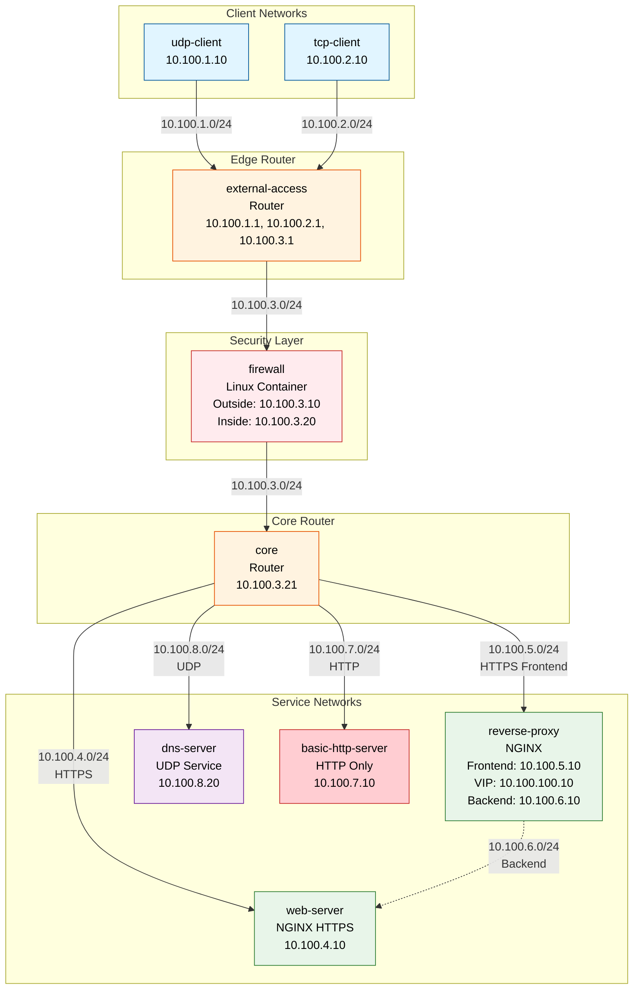
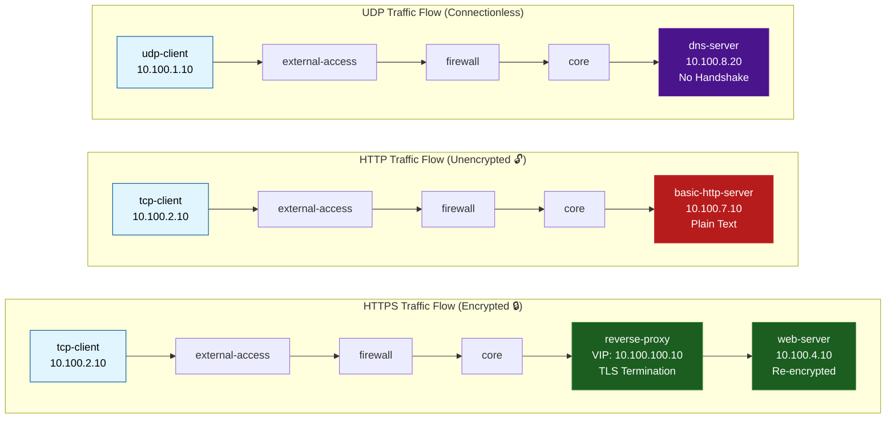
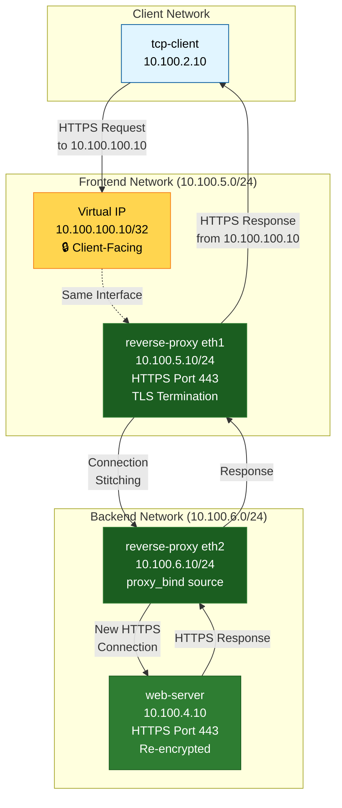
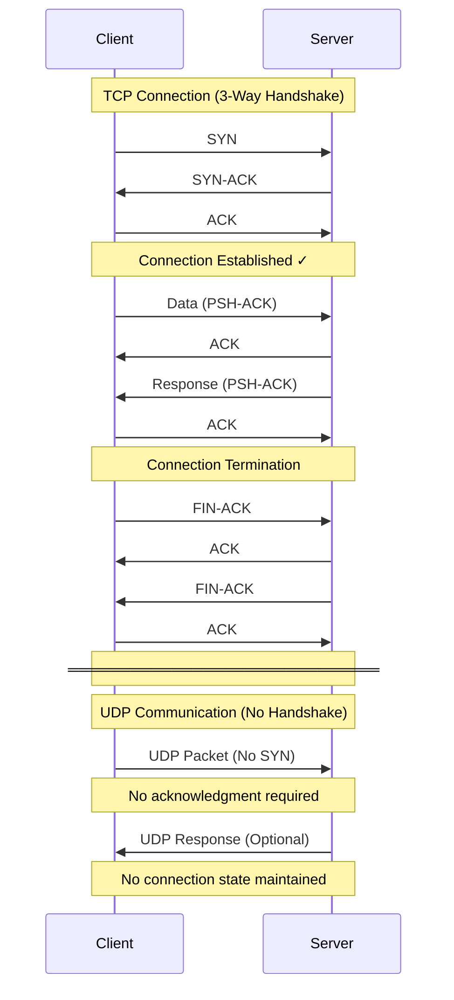
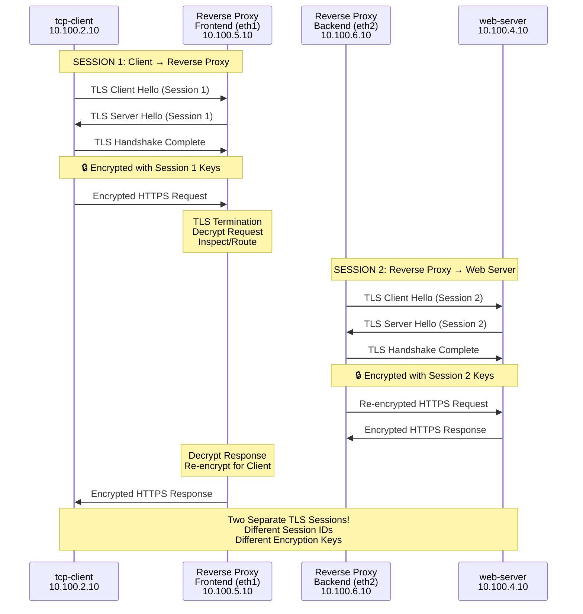

# Layer-4 Lab

The purpose of this lab is to illustrate UDP and TCP based services and how to troubleshoot them.

## Lab Overview

This lab demonstrates:
- **UDP Services**: DHCP for dynamic IP address assignment
- **TCP Services**: HTTP/HTTPS web services with reverse proxy architecture
- **Security Comparison**: Encrypted (HTTPS) vs Unencrypted (HTTP) traffic
- **Layer-4 Troubleshooting**: Analyzing TCP and UDP traffic flows
- **Service Architecture**: Multi-tier application with firewall and reverse proxy

## Lab Components

### Network Devices (Arista cEOS Routers)
- **external-access**: Entry point router for client traffic
- **core**: Central routing hub connecting to services

### Service Containers
- **firewall**: Linux container with IP forwarding (10.100.3.10 / 10.100.3.20)
- **reverse-proxy**: NGINX reverse proxy with HTTPS (10.100.5.10 + VIP 10.100.100.10)
- **web-server**: NGINX web server with HTTPS (10.100.6.10)
- **basic-http-server**: NGINX web server with HTTP only - UNENCRYPTED (10.100.7.10)
- **dns-server**: DNS/DHCP server (10.100.8.20)

### Client Containers
- **udp-client**: Client for testing UDP services (10.100.1.10)
- **tcp-client**: HTTP client for testing TCP services (10.100.2.10)

## Network Topology

### Visual Diagram



### Text Representation

```
udp-client      tcp-client
(10.100.1.10)   (10.100.2.10)
     \              /
      \            /
       \          /
    +----------------+
    | external-access|
    |  (Router)      |
    +----------------+
            |
            | 10.100.3.0/24
            |
       +----------+
       | firewall |
       | (Linux)  |
       +----------+
            |
            | 10.100.3.0/24
            |
    +----------------+
    |     core       |
    |   (Router)     |
    +----------------+
       /     |    \     \
      /      |     \     \
     /       |      \     \
reverse-   web-   dns-   basic-http-
proxy     server  server  server
(HTTPS)   (HTTPS) (UDP)   (HTTP)
10.100.5.10 10.100.4.10 10.100.8.20 10.100.7.10
VIP: 10.100.100.10
```

## Traffic Flows

### Visual Comparison



### TCP Traffic (HTTPS via Reverse Proxy) - ENCRYPTED 🔒
```
tcp-client (10.100.2.10)
    → external-access (10.100.2.1)
    → firewall (10.100.3.10 → 10.100.3.20)
    → core (10.100.3.21)
    → reverse-proxy frontend (10.100.5.10 / VIP 10.100.100.10) [HTTPS Port 443]
    → reverse-proxy backend (10.100.6.10)
    → web-server (10.100.6.10) [HTTPS Port 443]

Encryption: Client → Reverse-Proxy (TLS 1.2/1.3) → Web-Server (TLS 1.2/1.3)
```

### TCP Traffic (HTTP to Basic Server) - UNENCRYPTED 🔓
```
tcp-client (10.100.2.10)
    → external-access (10.100.2.1)
    → firewall (10.100.3.10 → 10.100.3.20)
    → core (10.100.3.21)
    → basic-http-server (10.100.7.10) [HTTP Port 80]

Encryption: NONE - All traffic is in plain text
```

### UDP Traffic (DNS/DHCP)
```
udp-client (10.100.1.10)
    → external-access (10.100.1.1)
    → firewall (10.100.3.10 → 10.100.3.20)
    → core (10.100.3.21)
    → dns-server (10.100.8.20)
```

## IP Addressing Scheme

### Router Loopbacks (Router IDs)
- external-access: 1.1.1.1/32
- core: 2.2.2.2/32

### Client Networks
- UDP Client Network: 10.100.1.0/24
  - udp-client: 10.100.1.10/24
  - Gateway: 10.100.1.1 (external-access)
- TCP Client Network: 10.100.2.0/24
  - tcp-client: 10.100.2.10/24
  - Gateway: 10.100.2.1 (external-access)

### Firewall Transit Network
- Network: 10.100.3.0/24
  - external-access: 10.100.3.1/24
  - firewall (outside): 10.100.3.10/24
  - firewall (inside): 10.100.3.20/24
  - core: 10.100.3.21/24

### Service Networks
- Web Server Network: 10.100.4.0/24
  - core: 10.100.4.1/24
  - web-server: 10.100.4.10/24
- Reverse Proxy Frontend Network: 10.100.5.0/24
  - core: 10.100.5.1/24
  - reverse-proxy (frontend): 10.100.5.10/24
  - VIP: 10.100.100.10/32 (on reverse-proxy)
- Reverse Proxy Backend Network: 10.100.6.0/24
  - core: 10.100.6.1/24
  - reverse-proxy (backend): 10.100.6.10/24
- Basic HTTP Server Network: 10.100.7.0/24
  - core: 10.100.7.1/24
  - basic-http-server: 10.100.7.10/24
- DNS Server Network: 10.100.8.0/24
  - core: 10.100.8.1/24
  - dns-server: 10.100.8.20/24

## Reverse Proxy Architecture

The reverse proxy uses a **two-interface design** for connection stitching:



**Key Features:**
- **Frontend Interface (eth1)**: Receives client connections on VIP 10.100.100.10
- **Backend Interface (eth2)**: Creates new connections to web-server using `proxy_bind`
- **Connection Stitching**: NGINX terminates client connection and creates new backend connection
- **End-to-End Encryption**: TLS from client to proxy, then re-encrypted from proxy to server

---

## Part 0: Lab Setup and Verification

### Starting the Lab

```bash
cd labs/Seminar-4
make start
```

Wait 2-3 minutes for all containers to start.

### Verify Lab Status

```bash
make inspect
```

### Verify Static Routing

Check routing tables on all routers:

```bash
# On external-access
ssh admin@external-access
show ip route

# On core
ssh admin@core
show ip route
```

Expected: Static routes should be configured for all networks.

### Verify Service Connectivity

Test basic connectivity from routers to services:

```bash
# From external-access, ping all services
ssh admin@external-access
ping 10.100.3.10  # Firewall
ping 10.100.5.10  # Reverse Proxy
ping 10.100.4.10  # Web Server
ping 10.100.4.20  # DNS Server
```

---

## Part 1: Basic UDP and TCP Connectivity

### Exercise 1.1: DNS/UDP Service

#### Test DNS Server Connectivity

```bash
# Access UDP client
docker exec -it udp-client sh

# Verify IP address
ip addr show eth1

# Check routing table
ip route

# Test connectivity to DNS server
ping -c 3 10.100.8.20
```

Expected: Client should have static IP 10.100.1.10 with default gateway 10.100.1.1.

#### Verify Network Path with Traceroute

```bash
# From udp-client, trace the path to DNS server
docker exec -it udp-client traceroute -n 10.100.8.20
```

Expected path:
```
1. 10.100.1.1    (external-access)
2. 10.100.3.10   (firewall)
3. 10.100.3.21   (core)
4. 10.100.8.20   (dns-server)
```

#### Test UDP Communication

Set up a UDP echo server on dns-server and test bidirectional communication:

```bash
# Terminal 1: Start UDP echo server on dns-server
docker exec -d dns-server sh -c "while true; do nc -u -l -p 5353 -e /bin/cat; done"

# Terminal 2: Send UDP packet from udp-client and receive response
docker exec -it udp-client sh -c "echo 'Hello DNS Server' | nc -u -w 2 10.100.8.20 5353"
```

Expected: You should see the echo response from the DNS server.

#### Capture UDP Traffic - Detailed Analysis

This exercise demonstrates UDP packet capture and analysis across the network path.

**Step 1: Capture on DNS Server (Destination)**

```bash
# Terminal 1: Start packet capture on dns-server
docker exec -it dns-server tcpdump -i eth1 -n -v 'udp port 5353 or icmp'
```

**Step 2: Generate UDP Traffic**

```bash
# Terminal 2: Send UDP packets from udp-client
docker exec -it udp-client sh -c "echo 'UDP Test Packet' | nc -u -w 2 10.100.8.20 5353"

# Also test with ICMP (ping)
docker exec -it udp-client ping -c 3 10.100.8.20
```

**Expected Output on dns-server:**
```
# UDP packet capture
IP 10.100.1.10.xxxxx > 10.100.8.20.5353: UDP, length 16

# ICMP packet capture
IP 10.100.1.10 > 10.100.8.20: ICMP echo request, id xxxxx, seq 1, length 64
IP 10.100.8.20 > 10.100.1.10: ICMP echo reply, id xxxxx, seq 1, length 64
```

**Step 3: Capture on Intermediate Router**

```bash
# On core router, capture traffic to/from DNS server
ssh admin@core
bash
tcpdump -i eth5 -n -v 'host 10.100.8.20'
```

Then generate traffic from another terminal:
```bash
docker exec -it udp-client ping -c 3 10.100.8.20
```

**Analysis Points:**
1. **UDP is connectionless**: No handshake like TCP (no SYN/ACK)
2. **Packet delivery**: UDP packets are sent without acknowledgment
3. **Network path**: Packets traverse external-access → firewall → core → dns-server
4. **Port numbers**: Source port is ephemeral, destination port is 5353 (or 53 for DNS)

### Exercise 1.2: HTTP (TCP Service)

#### Test Direct Web Server Access

```bash
# From TCP client, test web server
docker exec -it tcp-client sh

# Test web server directly
curl http://10.100.4.10/

# Test health endpoint
curl http://10.100.4.10/health

# Test API endpoint
curl http://10.100.4.10/api
```

#### Test Through Reverse Proxy

```bash
# From TCP client
docker exec -it tcp-client sh

# Test reverse proxy
curl http://10.100.5.10/

# Test proxy health
curl http://10.100.5.10/health
```

#### Capture HTTP Traffic

```bash
# On core router, capture HTTP traffic
ssh admin@core
bash
tcpdump -i eth3 port 80 -A -s 0
```

Then make HTTP request from client:
```bash
docker exec -it tcp-client curl http://10.100.5.10/
```

Observe:
- TCP 3-way handshake (SYN, SYN-ACK, ACK)
- HTTP GET request
- HTTP 200 OK response
- TCP connection teardown (FIN, ACK)

---

## Part 2: Troubleshooting UDP and TCP Connectivity

### Exercise 2.1: Troubleshooting DNS/UDP Issues

#### Scenario 1: DNS Server Not Responding

Simulate DNS server failure:
```bash
# Stop DNS server
docker stop dns-server

# Try to ping from client
docker exec -it udp-client ping -c 3 10.100.8.20
```

Expected: Client should timeout.

Troubleshooting steps:
```bash
# 1. Verify client can reach DNS server network gateway
docker exec -it udp-client ping 10.100.8.1

# 2. Check routing
docker exec -it udp-client ip route

# 3. Verify DNS server is running
docker ps | grep dns-server

# 4. Check DNS server logs
docker logs dns-server
```

Fix:
```bash
# Restart DNS server
docker start dns-server

# Retry connectivity
docker exec -it udp-client ping -c 3 10.100.8.20
```

#### Scenario 2: Routing Issues

Check if packets reach the server:
```bash
# On core router
ssh admin@core
bash
tcpdump -i eth5 icmp -n

# From another terminal, generate traffic
docker exec -it udp-client ping -c 3 10.100.8.20
```

If no packets seen, check intermediate routers:
```bash
# On external-access
ssh admin@external-access
bash
tcpdump -i eth1 icmp -n
```

### Exercise 2.2: Troubleshooting HTTP Issues

#### Scenario 1: Web Server Down

Simulate web server failure:
```bash
# Stop web server
docker stop web-server

# Try to access from client
docker exec -it tcp-client curl -v http://10.100.5.10/
```

Expected: Connection timeout or connection refused.

Troubleshooting steps:
```bash
# 1. Test connectivity to web server IP
docker exec -it tcp-client ping 10.100.4.10

# 2. Test if port 80 is open
docker exec -it tcp-client nc -zv 10.100.4.10 80

# 3. Check web server status
docker ps | grep web-server

# 4. Check web server logs
docker logs web-server
```

Fix:
```bash
# Restart web server
docker start web-server

# Wait a few seconds, then retry
docker exec -it tcp-client curl http://10.100.5.10/
```

#### Scenario 2: Reverse Proxy Misconfiguration

Check reverse proxy configuration:
```bash
# Access reverse proxy
docker exec -it reverse-proxy sh

# Check NGINX configuration
cat /etc/nginx/nginx.conf

# Check NGINX error logs
cat /var/log/nginx/error.log

# Test backend connectivity from proxy
ping 10.100.4.10
nc -zv 10.100.4.10 80
```

#### Scenario 3: Network Path Issues

Trace the path from client to web server:
```bash
# From TCP client
docker exec -it tcp-client traceroute 10.100.4.10

# Expected path:
# 1. 10.100.2.1 (external-access)
# 2. 10.100.3.10 (firewall outside)
# 3. 10.100.3.21 (core)
# 4. 10.100.4.10 (web-server)
```

Check routing on each hop:
```bash
# On external-access
ssh admin@external-access
show ip route 10.100.4.10

# On core
ssh admin@core
show ip route 10.100.4.10
```

Check firewall forwarding:
```bash
# On firewall
docker exec -it firewall sysctl net.ipv4.ip_forward
docker exec -it firewall ip route
```

### Exercise 2.3: Protocol Analysis

#### TCP vs UDP Protocol Comparison

Understanding the fundamental differences between TCP and UDP:



**Key Differences:**
- **TCP**: Connection-oriented, reliable, ordered delivery, flow control
- **UDP**: Connectionless, unreliable, no ordering, minimal overhead

#### TCP Connection Analysis

Capture and analyze TCP connection establishment:
```bash
# On external-access
ssh admin@external-access
bash
tcpdump -i eth3 'tcp port 80' -nn -S

# From another terminal
docker exec -it tcp-client curl http://10.100.5.10/
```

Analyze the output:
1. **SYN**: Client initiates connection
2. **SYN-ACK**: Server acknowledges and responds
3. **ACK**: Client acknowledges (connection established)
4. **PSH-ACK**: HTTP request sent
5. **ACK**: Server acknowledges request
6. **PSH-ACK**: HTTP response sent
7. **FIN-ACK**: Connection termination

#### UDP Packet Analysis

Capture and analyze UDP packets at different points in the network:

```mermaid
graph LR
    subgraph Client["Source"]
        UC["udp-client<br/>10.100.1.10<br/>📊 Capture Point 1"]
    end

    subgraph Router1["First Hop"]
        EA["external-access<br/>10.100.1.1<br/>📊 Capture Point 2<br/>tcpdump -i eth1"]
    end

    subgraph Security["Security Layer"]
        FW["firewall<br/>10.100.3.10/20<br/>📊 Capture Point 3<br/>tcpdump -i eth1/eth2"]
    end

    subgraph Router2["Core Router"]
        CR["core<br/>10.100.3.21<br/>📊 Capture Point 4<br/>tcpdump -i eth5"]
    end

    subgraph Server["Destination"]
        DNS["dns-server<br/>10.100.8.20<br/>📊 Capture Point 5<br/>tcpdump -i eth1"]
    end

    UC -->|"UDP Packet<br/>Src: 10.100.1.10:xxxxx<br/>Dst: 10.100.8.20:5353"| EA
    EA -->|"Forwarded<br/>via 10.100.3.1"| FW
    FW -->|"Routed<br/>via 10.100.3.20"| CR
    CR -->|"Delivered<br/>via eth5"| DNS
    DNS -.->|"UDP Response<br/>(Optional)"| CR
    CR -.->|"Return Path"| FW
    FW -.->|"Return Path"| EA
    EA -.->|"Return Path"| UC

    style UC fill:#e1f5ff,stroke:#01579b,color:#000
    style EA fill:#fff3e0,stroke:#e65100,color:#000
    style FW fill:#ffebee,stroke:#c62828,color:#000
    style CR fill:#fff3e0,stroke:#e65100,color:#000
    style DNS fill:#f3e5f5,stroke:#6a1b9a,color:#000
```



**Capture 1: On DNS Server (Destination)**
```bash
# Terminal 1: Capture on dns-server
docker exec -it dns-server tcpdump -i eth1 -n -v 'udp port 5353 or icmp'

# Terminal 2: Generate UDP traffic
docker exec -it udp-client sh -c "echo 'Test UDP' | nc -u -w 2 10.100.8.20 5353"
docker exec -it udp-client ping -c 2 10.100.8.20
```

**Capture 2: On Core Router (Intermediate Hop)**
```bash
# On core router
ssh admin@core
bash
tcpdump -i eth5 -n -v 'host 10.100.8.20'

# From another terminal
docker exec -it udp-client ping -c 3 10.100.8.20
```

**Capture 3: On External-Access Router (First Hop)**
```bash
# On external-access
ssh admin@external-access
bash
tcpdump -i eth1 -n -v 'host 10.100.1.10'

# From another terminal
docker exec -it udp-client ping -c 3 10.100.8.20
```

**Analyze UDP vs ICMP traffic:**
1. **UDP Packets**: Connectionless, no handshake, no acknowledgment
   - Source: 10.100.1.10 (ephemeral port)
   - Destination: 10.100.8.20:5353
   - No TCP flags (SYN, ACK, FIN)
2. **ICMP Packets**: Used for ping (echo request/reply)
   - Echo Request: 10.100.1.10 → 10.100.8.20
   - Echo Reply: 10.100.8.20 → 10.100.1.10
3. **Key Differences from TCP**:
   - No connection establishment (no SYN/SYN-ACK/ACK)
   - No sequence numbers or acknowledgments
   - Lower overhead, faster but unreliable delivery

---

## Part 3: HTTP vs HTTPS Security Comparison

### Exercise 3.1: Compare Encrypted vs Unencrypted Traffic

This exercise demonstrates the critical difference between HTTP (unencrypted) and HTTPS (encrypted) traffic.

#### Test Both Services

```bash
# From TCP client
docker exec -it tcp-client sh

# Test HTTPS service (encrypted)
curl -k https://10.100.100.10/health
# Output: Reverse Proxy OK (HTTPS)

# Test HTTP service (unencrypted)
curl http://10.100.7.10/health
# Output: Basic HTTP Server OK (UNENCRYPTED)
```

#### Compare Web Pages

```bash
# Access HTTPS web page (secure)
curl -k https://10.100.100.10/ | head -20

# Access HTTP web page (insecure)
curl http://10.100.7.10/ | head -20
```

**Observation**: Notice the security warnings on the HTTP page!

### Exercise 3.2: Packet Capture Analysis - See the Difference!

This is the most important exercise - it shows WHY HTTPS is essential.

#### Capture HTTP Traffic (Unencrypted)

```bash
# On core router, capture HTTP traffic to basic-http-server
ssh admin@core
bash
tcpdump -i eth6 port 80 -A -s 0

# From another terminal, make HTTP request
docker exec -it tcp-client curl http://10.100.7.10/api
```

**What you'll see**:
- ✅ You can READ the entire HTTP request in plain text
- ✅ You can see the JSON response: `{"status":"ok","server":"basic-http-server"...}`
- ✅ Headers, cookies, and all data are VISIBLE
- 🔓 **This is INSECURE!**

#### Capture HTTPS Traffic (Encrypted)

```bash
# On core router, capture HTTPS traffic to reverse-proxy
ssh admin@core
bash
tcpdump -i eth2 port 443 -A -s 0

# From another terminal, make HTTPS request
docker exec -it tcp-client curl -k https://10.100.100.10/api
```

**What you'll see**:
- ❌ You CANNOT read the HTTP request - it's encrypted
- ❌ You CANNOT see the response data - it's encrypted
- ✅ You only see TLS handshake and encrypted binary data
- 🔒 **This is SECURE!**

### Exercise 3.3: Two HTTPS Sessions - Connection Stitching Analysis

This exercise demonstrates how the reverse proxy creates **TWO separate HTTPS sessions**:
1. **Session 1**: Client → Reverse Proxy (TLS termination)
2. **Session 2**: Reverse Proxy → Web Server (Re-encryption)

#### Understanding the Architecture

The reverse proxy performs **connection stitching**:
- Receives encrypted HTTPS from client on **frontend interface (eth1)**
- Decrypts the traffic to inspect/route it
- Re-encrypts the traffic with a new TLS session
- Sends to web server from **backend interface (eth2)**



#### Step 1: Monitor NGINX Logs in Real-Time

Open **three terminals** to monitor both services:

```bash
# Terminal 1: Monitor reverse-proxy access logs
docker exec -it reverse-proxy tail -f /var/log/nginx/access.log

# Terminal 2: Monitor web-server access logs
docker exec -it web-server tail -f /var/log/nginx/access.log

# Terminal 3: Monitor reverse-proxy error logs (for debugging)
docker exec -it reverse-proxy tail -f /var/log/nginx/error.log
```

#### Step 2: Capture Both HTTPS Sessions Simultaneously

Open **two more terminals** for packet capture:

```bash
# Terminal 4: Capture Session 1 (Client → Reverse Proxy)
# On core router, interface eth2 (frontend network 10.100.5.0/24)
ssh admin@core
bash
tcpdump -i eth2 'host 10.100.5.10 and port 443' -nn -v

# Terminal 5: Capture Session 2 (Reverse Proxy → Web Server)
# On core router, interface eth3 (backend network 10.100.6.0/24)
ssh admin@core
bash
tcpdump -i eth3 'host 10.100.6.10 and port 443' -nn -v
```

#### Step 3: Generate HTTPS Traffic

```bash
# Terminal 6: Generate HTTPS requests
docker exec -it tcp-client sh

# Make multiple requests to see the pattern
curl -k https://10.100.100.10/health
curl -k https://10.100.100.10/api
curl -k https://10.100.100.10/hostname
```

#### Step 4: Analyze the Results

**What you should observe:**

**In Terminal 1 (Reverse Proxy Logs):**
```
10.100.2.10 - - [timestamp] "GET /health HTTP/1.1" 200 ...
10.100.2.10 - - [timestamp] "GET /api HTTP/1.1" 200 ...
10.100.2.10 - - [timestamp] "GET /hostname HTTP/1.1" 200 ...
```
- Source IP: **10.100.2.10** (tcp-client)
- This is the **client-facing** session

**In Terminal 2 (Web Server Logs):**
```
10.100.6.10 - - [timestamp] "GET /health HTTP/1.1" 200 ...
10.100.6.10 - - [timestamp] "GET /api HTTP/1.1" 200 ...
10.100.6.10 - - [timestamp] "GET /hostname HTTP/1.1" 200 ...
```
- Source IP: **10.100.6.10** (reverse-proxy backend interface)
- This is the **backend** session created by proxy

**In Terminal 4 (Session 1 Packet Capture):**
```
Client IP: 10.100.2.10 → Reverse Proxy VIP: 10.100.100.10:443
- TLS handshake (Client Hello, Server Hello)
- Encrypted application data
- Source: tcp-client
- Destination: reverse-proxy frontend
```

**In Terminal 5 (Session 2 Packet Capture):**
```
Reverse Proxy Backend: 10.100.6.10 → Web Server: 10.100.4.10:443
- SEPARATE TLS handshake (new session!)
- Encrypted application data
- Source: reverse-proxy backend interface
- Destination: web-server
```

#### Step 5: Verify Two Separate TLS Sessions

Capture to files for detailed analysis:

```bash
# On core router
ssh admin@core
bash

# Capture Session 1 (Client → Proxy)
tcpdump -i eth2 'host 10.100.5.10 and port 443' -w /tmp/session1_client_to_proxy.pcap &
PID1=$!

# Capture Session 2 (Proxy → Server)
tcpdump -i eth3 'host 10.100.6.10 and port 443' -w /tmp/session2_proxy_to_server.pcap &
PID2=$!

# Wait a moment for captures to start
sleep 2

# Generate traffic from another terminal
docker exec -it tcp-client curl -k https://10.100.100.10/

# Wait for traffic to complete
sleep 3

# Stop captures
kill $PID1 $PID2

# Analyze the captures
echo "=== Session 1: Client → Reverse Proxy ==="
tcpdump -r /tmp/session1_client_to_proxy.pcap -nn | head -20

echo ""
echo "=== Session 2: Reverse Proxy → Web Server ==="
tcpdump -r /tmp/session2_proxy_to_server.pcap -nn | head -20
```

#### Step 6: Count TLS Handshakes

```bash
# Count TLS Client Hello messages in Session 1
tcpdump -r /tmp/session1_client_to_proxy.pcap -nn -A | grep -c "Client Hello" || echo "0"

# Count TLS Client Hello messages in Session 2
tcpdump -r /tmp/session2_proxy_to_server.pcap -nn -A | grep -c "Client Hello" || echo "0"
```

**Expected Result**: You should see TLS handshakes in BOTH captures, proving there are TWO separate HTTPS sessions!

#### Key Observations

1. **Two Different Source IPs in Logs**:
   - Reverse proxy sees: 10.100.2.10 (actual client)
   - Web server sees: 10.100.6.10 (reverse proxy backend)

2. **Two Separate TLS Sessions**:
   - Session 1: Different TLS session ID and keys
   - Session 2: Different TLS session ID and keys

3. **Connection Stitching**:
   - Reverse proxy terminates client TLS session
   - Decrypts, inspects, and routes the request
   - Creates NEW TLS session to web server
   - Returns response through client session

4. **Security Benefit**:
   - Reverse proxy can inspect traffic (load balancing, WAF, caching)
   - End-to-end encryption maintained (client → proxy → server)
   - Web server doesn't see client IP directly (privacy/security)

### Exercise 3.4: Wireshark Analysis (Advanced)

For a more detailed analysis, you can use Wireshark:

```bash
# Copy capture files to your local machine
docker cp core:/tmp/session1_client_to_proxy.pcap .
docker cp core:/tmp/session2_proxy_to_server.pcap .

# Also capture HTTP traffic for comparison
ssh admin@core
bash
tcpdump -i eth6 port 80 -w /tmp/http_traffic.pcap &
docker exec -it tcp-client curl http://10.100.7.10/
killall tcpdump
docker cp core:/tmp/http_traffic.pcap .
```

Open all files in Wireshark and compare:
- **session1_client_to_proxy.pcap**: TLS handshake between client and proxy
- **session2_proxy_to_server.pcap**: SEPARATE TLS handshake between proxy and server
- **http_traffic.pcap**: Plain text HTTP (no encryption)

**Wireshark Analysis Steps**:
1. Open session1 → Statistics → Conversations → TCP tab → Note the connection
2. Open session2 → Statistics → Conversations → TCP tab → Note DIFFERENT connection
3. Filter by `ssl.handshake.type == 1` to see Client Hello messages
4. Compare TLS session IDs - they will be DIFFERENT!

### Exercise 3.5: SSL/TLS Certificate Inspection

Inspect the SSL/TLS certificates used by the HTTPS service:

```bash
# From TCP client, inspect reverse-proxy certificate
docker exec -it tcp-client sh

# View certificate details
echo | openssl s_client -connect 10.100.100.10:443 -showcerts 2>/dev/null | openssl x509 -text -noout

# Check certificate subject and issuer
echo | openssl s_client -connect 10.100.100.10:443 2>/dev/null | grep -E '(subject=|issuer=)'
```

**Expected output**:
- Subject: CN=10.100.100.10
- Issuer: CN=Lab-CA (self-signed)

#### Verify Certificate Chain

```bash
# Test certificate validation
curl -v https://10.100.100.10/ 2>&1 | grep -E '(SSL|certificate|issuer)'

# With -k flag (insecure - skips validation)
curl -k -v https://10.100.100.10/ 2>&1 | grep -E '(SSL|certificate)'
```

### Exercise 3.6: Security Analysis Questions

Answer these questions based on your observations:

1. **What information can an attacker see in HTTP traffic?**
   - Hint: Capture HTTP traffic and look at the plain text

2. **What information can an attacker see in HTTPS traffic?**
   - Hint: Capture HTTPS traffic and try to read it

3. **Why is HTTPS essential for production web applications?**
   - Think about passwords, credit cards, personal data

4. **What is the role of SSL/TLS certificates?**
   - Hint: They provide encryption AND authentication

5. **What happens if you access the HTTPS service without the -k flag?**
   - Try: `curl https://10.100.100.10/` (without -k)
   - Why does it fail?

### Exercise 3.6: Performance Comparison

Compare the performance overhead of encryption:

```bash
# From TCP client
docker exec -it tcp-client sh

# Test HTTP performance (no encryption)
time for i in $(seq 1 100); do curl -s http://10.100.7.10/health > /dev/null; done

# Test HTTPS performance (with encryption)
time for i in $(seq 1 100); do curl -s -k https://10.100.100.10/health > /dev/null; done
```

**Question**: Is the encryption overhead significant? Is it worth the security benefit?

---

## Part 4: Advanced Exercises

### Exercise 4.1: Implement Firewall Rules

Configure iptables on the firewall container:

```bash
# Access firewall
docker exec -it firewall sh

# View current rules
iptables -L -n -v

# Allow HTTP traffic
iptables -A FORWARD -p tcp --dport 80 -j ACCEPT
iptables -A FORWARD -p tcp --sport 80 -j ACCEPT

# Allow ICMP traffic
iptables -A FORWARD -p icmp -j ACCEPT

# Enable NAT (if needed)
iptables -t nat -A POSTROUTING -o eth1 -j MASQUERADE

# Block specific traffic (example)
iptables -A FORWARD -s 10.100.2.10 -d 10.100.4.20 -j DROP

# Save rules
iptables-save
```

Test firewall rules:
```bash
# Should work (HTTP allowed)
docker exec -it tcp-client curl http://10.100.5.10/

# Should fail if blocked
docker exec -it tcp-client ping 10.100.4.20
```

### Exercise 4.2: Monitor Service Performance

#### Check Web Server Performance

```bash
# From TCP client, run multiple requests
docker exec -it tcp-client sh

# Run multiple requests
for i in $(seq 1 100); do
  curl -s http://10.100.5.10/ > /dev/null
  echo "Request $i completed"
done
```

Monitor on web server:
```bash
# Check NGINX access logs
docker exec -it web-server tail -f /var/log/nginx/access.log

# Check connections
docker exec -it web-server netstat -an | grep :80
```

### Exercise 4.3: Service Health Checks

Create a monitoring script:
```bash
# On TCP client
docker exec -it tcp-client sh

# Create health check script
cat > /tmp/health_check.sh << 'EOF'
#!/bin/sh
echo "=== Service Health Check ==="
echo ""

echo "🔒 HTTPS Service (Encrypted):"
curl -s -k https://10.100.100.10/health || echo "FAILED"
echo ""

echo "🔓 HTTP Service (Unencrypted):"
curl -s http://10.100.7.10/health || echo "FAILED"
echo ""

echo "Web Server (Backend):"
curl -s -k https://10.100.6.10/health || echo "FAILED"
echo ""

echo "DNS Server:"
ping -c 1 10.100.4.20 > /dev/null && echo "OK" || echo "FAILED"
echo ""

echo "=== Network Connectivity ==="
ping -c 1 10.100.100.10 > /dev/null && echo "HTTPS VIP: OK" || echo "HTTPS VIP: FAILED"
ping -c 1 10.100.7.10 > /dev/null && echo "HTTP Server: OK" || echo "HTTP Server: FAILED"
ping -c 1 10.100.6.10 > /dev/null && echo "Web Server: OK" || echo "Web Server: FAILED"
ping -c 1 10.100.4.20 > /dev/null && echo "DNS Server: OK" || echo "DNS Server: FAILED"
EOF

chmod +x /tmp/health_check.sh
/tmp/health_check.sh
```

---

## Lab Commands Reference

### Starting/Stopping the Lab

```bash
# Start lab
cd labs/Seminar-4
make start

# Check status
make inspect

# Stop lab
make stop
```

### Accessing Devices

```bash
# SSH to routers
ssh admin@external-access
ssh admin@core

# Access containers (without clab-Layer-4- prefix)
docker exec -it <container-name> sh

# Examples:
docker exec -it firewall sh
docker exec -it tcp-client sh
docker exec -it web-server sh
```

### Useful Commands

#### Network Troubleshooting
```bash
# Ping
ping <ip>

# Traceroute
traceroute <ip>

# Check routing
ip route
show ip route  # On routers

# Check interfaces
ip addr
show ip interface brief  # On routers

# Port scanning
nc -zv <ip> <port>

# DNS lookup
nslookup <hostname>
```

#### Packet Capture
```bash
# On routers (enter bash first)
bash
tcpdump -i <interface> <filter>

# Examples:
tcpdump -i eth1 port 80
tcpdump -i eth2 'port 67 or port 68'
tcpdump -i eth3 -nn -v
```

#### Service Testing
```bash
# HTTP requests
curl http://<ip>/
curl -v http://<ip>/  # Verbose
curl -I http://<ip>/  # Headers only

# DHCP
udhcpc -i eth1        # Request IP
udhcpc -i eth1 -r     # Release IP
```

---

## Troubleshooting Guide

### DNS/UDP Not Working

1. **Check DNS server is running**
   ```bash
   docker ps | grep dns-server
   docker logs dns-server
   ```

2. **Verify network connectivity**
   ```bash
   docker exec -it udp-client ping 10.100.8.20
   ```

3. **Check routing**
   ```bash
   docker exec -it udp-client ip route
   docker exec -it udp-client traceroute -n 10.100.8.20
   ssh admin@external-access
   show ip route 10.100.8.0
   ssh admin@core
   show ip route 10.100.8.0
   ```

4. **Test UDP communication**
   ```bash
   # Start UDP echo server on dns-server
   docker exec -d dns-server sh -c "while true; do nc -u -l -p 5353 -e /bin/cat; done"

   # Test from udp-client
   docker exec -it udp-client sh -c "echo 'Test' | nc -u -w 2 10.100.8.20 5353"
   ```

5. **Capture packets to verify delivery**
   ```bash
   # On dns-server
   docker exec -it dns-server tcpdump -i eth1 -n 'host 10.100.1.10'

   # From another terminal, generate traffic
   docker exec -it udp-client ping -c 3 10.100.8.20
   ```

### HTTP Not Working

1. **Check web server is running**
   ```bash
   docker ps | grep web-server
   docker logs web-server
   ```

2. **Test direct connectivity**
   ```bash
   docker exec -it tcp-client ping 10.100.4.10
   docker exec -it tcp-client nc -zv 10.100.4.10 80
   ```

3. **Check reverse proxy**
   ```bash
   docker logs reverse-proxy
   docker exec -it reverse-proxy cat /etc/nginx/nginx.conf
   ```

4. **Verify routing**
   ```bash
   ssh admin@external-access
   show ip route 10.100.4.10
   ```

5. **Check MTU settings**
   ```bash
   docker exec -it tcp-client ip link show eth1
   docker exec -it web-server ip link show eth1
   # MTU should be 1500
   ```

### Static Routing Issues

1. **Check routing tables**
   ```bash
   ssh admin@external-access
   show ip route

   ssh admin@core
   show ip route
   ```

2. **Verify firewall forwarding**
   ```bash
   docker exec -it firewall sysctl net.ipv4.ip_forward
   docker exec -it firewall ip route
   ```

---

## Learning Objectives

After completing this lab, you should understand:

1. **UDP vs TCP**
   - Connectionless (UDP) vs Connection-oriented (TCP)
   - UDP use cases (DNS, streaming, simple queries)
   - TCP use cases (HTTP, HTTPS, SSH, databases)

2. **HTTP vs HTTPS**
   - HTTP (unencrypted) vs HTTPS (encrypted with TLS)
   - SSL/TLS encryption and certificate management
   - Security implications of unencrypted traffic
   - Why HTTPS is essential for production applications
   - Certificate authorities and trust chains

3. **HTTP/HTTPS Protocols**
   - TCP 3-way handshake
   - HTTP request/response cycle
   - TLS handshake and encryption
   - Connection management
   - MTU and packet fragmentation issues

4. **Service Architecture**
   - Reverse proxy benefits and SSL termination
   - End-to-end encryption architecture
   - Firewall placement and IP forwarding
   - Multi-tier applications
   - Static routing in service networks
   - Virtual IP (VIP) configuration

5. **Security Analysis**
   - Packet capture and traffic analysis
   - Identifying sensitive data in plain text HTTP
   - Understanding encryption benefits
   - Certificate validation and trust

6. **Troubleshooting**
   - Packet capture and analysis (tcpdump, Wireshark)
   - Layer-4 connectivity testing
   - Service health monitoring
   - MTU troubleshooting
   - SSL/TLS certificate issues

---

## Expected Outcomes

✅ Static routing working between all routers
✅ UDP client can reach DNS server
✅ TCP client can access HTTPS service (encrypted) via VIP 10.100.100.10
✅ TCP client can access HTTP service (unencrypted) at 10.100.7.10
✅ SSL/TLS certificates automatically generated at lab boot
✅ Packet captures show difference between HTTP (plain text) and HTTPS (encrypted)
✅ Understanding of why HTTPS is essential for security
✅ Troubleshooting scenarios successfully resolved
✅ Firewall IP forwarding working correctly
✅ Service health monitoring implemented
✅ MTU configured correctly (1500 bytes) on all service containers

